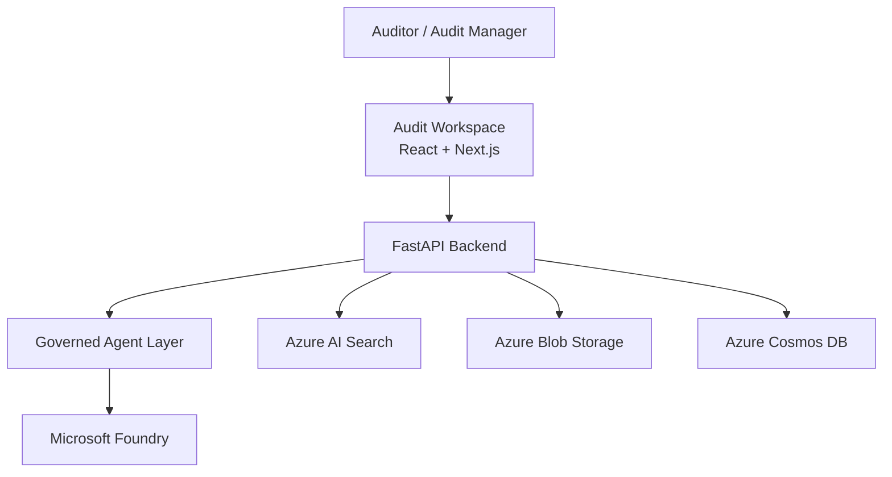
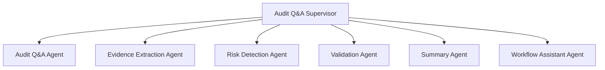
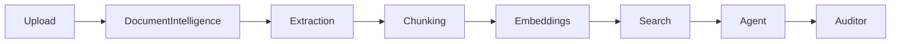
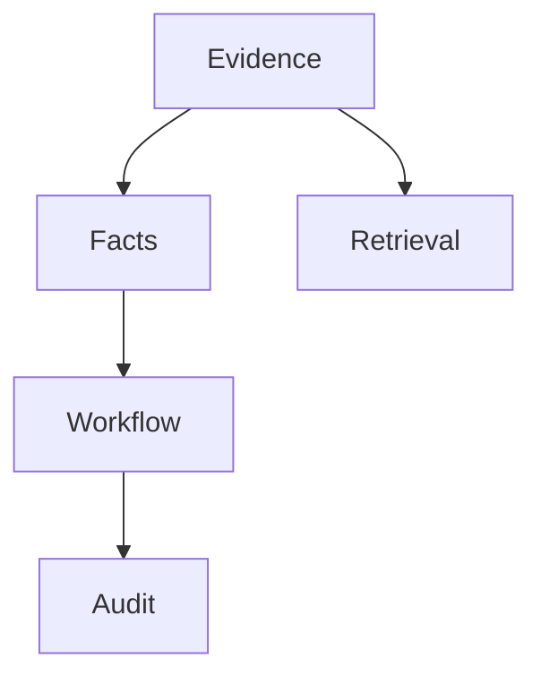

# Audit Workspace – AI-Powered Financial Audit Platform

## Project Overview

I designed and architected Audit Workspace, an Azure-based AI-powered platform that helps financial auditors centralize audit evidence, automate document analysis, improve evidence discovery, and accelerate audit reviews using Retrieval-Augmented Generation (RAG) and governed AI agents.

The platform assists auditors but does not replace auditor judgment. Every AI-generated output is grounded in source evidence and remains traceable back to audit artifacts.

---

# Business Problem

Financial auditors work across:

- Financial statements
- Trial balances
- General ledgers
- Bank statements
- Invoices
- Receipts
- Supporting audit evidence

Challenges included:

- Large volumes of documents
- Manual evidence review
- Slow evidence discovery
- Limited semantic search capability
- Poor traceability between findings and evidence
- Difficulty identifying risks across multiple documents

The goal was to build a unified audit workspace that improves auditor productivity while maintaining compliance, governance, and audit defensibility.

---

# My Role

## Solution Architect / GenAI Architect

Key responsibilities:

- End-to-end solution architecture
- GenAI architecture design
- Multi-agent architecture design
- RAG architecture design
- Security architecture
- Governance architecture
- Evaluation framework design
- Memory architecture
- Observability architecture
- Azure platform architecture
- Architecture Decision Records (ADRs)

---

# Solution Architecture

The architecture follows a Modular Monolith First approach with governed AI agents, domain-governed memory, and evaluation-gated production deployment.

---

# Technology Stack

| Layer | Technology |
|---------|------------|
| Frontend | React / Next.js |
| Backend | Python FastAPI |
| Agent Runtime | Microsoft Agent Framework |
| AI Platform | Microsoft Foundry |
| Search | Azure AI Search |
| OCR & Extraction | Azure AI Document Intelligence |
| Object Storage | Azure Blob Storage |
| Operational Data | Azure Cosmos DB |
| Messaging | Azure Service Bus Premium |
| Identity | Microsoft Entra ID |
| Secrets | Azure Key Vault |
| Monitoring | Azure Monitor & Application Insights |

---

# Multi-Agent Architecture

The platform uses a governed multi-agent architecture.

## Agents

- Audit Q&A Agent
- Evidence Extraction Agent
- Risk Detection Agent
- Validation Agent
- Summary Agent
- Workflow Assistant Agent
- Audit Q&A Supervisor

Complex questions are handled by the Supervisor Agent, which coordinates specialist agents and synthesizes responses.

---

# Retrieval-Augmented Generation (RAG)

Document processing workflow:

Key capabilities:

- OCR and structured extraction
- Table extraction
- Metadata enrichment
- Semantic retrieval
- Hybrid search
- Grounded responses with citations

This significantly reduces hallucinations and improves audit traceability.

---

# Agent Registry & Governance

The platform includes a governed Agent Registry.

Capabilities:

- Agent lifecycle management
- Immutable versions
- Capability catalog
- Evaluation gates
- Activation controls
- Rollback support
- Frozen engagement versions

Every production agent version must be:

1. Evaluated
2. Approved
3. Activated through governance workflows

---

# Memory Architecture

Domain-Governed Memory includes:

- Evidence Memory
- Fact Memory
- Retrieval Memory
- Workflow Memory
- Conversation Memory
- Audit Memory

This architecture enables strong lineage, auditability, retention governance, and legal-hold support.

---

# Security Architecture

The platform follows Zero Trust principles.

Key controls:

- Microsoft Entra ID
- Multi-Factor Authentication
- RBAC + ABAC
- Engagement-level security boundaries
- Managed Identity
- Azure Key Vault
- Private Endpoints
- Prompt-injection defenses
- Audit logging

Agents cannot elevate privileges beyond the requesting user.

---

# Evaluation Framework

The solution includes a comprehensive evaluation platform.

Evaluation domains:

- Retrieval Quality
- Agent Quality
- Supervisor Quality
- Validation Quality
- Risk Detection Quality
- Workflow Quality
- Human Review Quality
- Cost Efficiency

Production activation requires evaluation approval.

---

# Observability

The platform captures:

- Distributed traces
- AI telemetry
- Cost telemetry
- Agent executions
- Workflow execution
- Governance events
- Security events
- Audit events

Every action is tracked using:

- TraceId
- CorrelationId
- CausationId

---

# Governance & Responsible AI

Governance domains:

- Agent Governance
- Prompt Governance
- Model Governance
- Evaluation Governance
- Data Governance
- Retention Governance
- Audit Governance

Human oversight is mandatory for:

- Findings
- Conclusions
- Governance exceptions
- Audit approvals

Final accountability always remains with the auditor.

---

# Business Impact

The platform delivers:

- Faster audit turnaround
- Reduced manual review effort
- Improved evidence discovery
- Better financial risk identification
- Improved audit traceability
- Enterprise-grade governance
- Responsible AI adoption

---

# 60-Second Project Summary

I architected Audit Workspace, an Azure-based AI-powered platform for financial auditors. The solution centralizes audit evidence, uses Azure AI Document Intelligence for document extraction, Azure AI Search for retrieval, and Microsoft Foundry with a governed multi-agent architecture for audit assistance. I designed the end-to-end architecture including RAG pipelines, agent governance, memory architecture, evaluation frameworks, observability, security, and Responsible AI controls. The platform provides grounded audit Q&A, evidence extraction, risk detection, and validation workflows while maintaining full traceability, governance compliance, and mandatory human oversight for audit conclusions.
