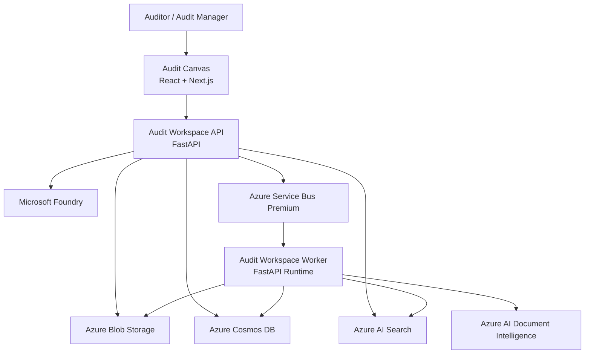
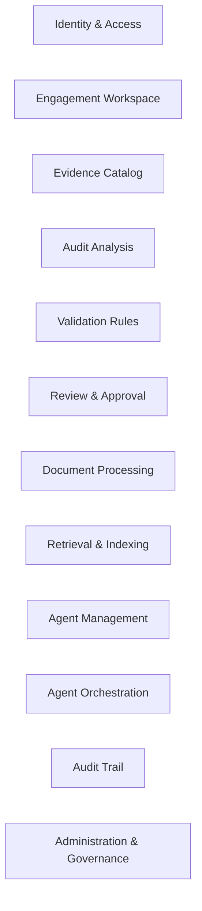
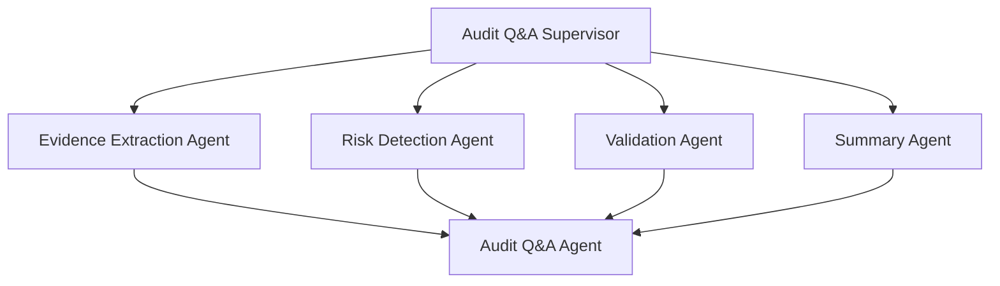
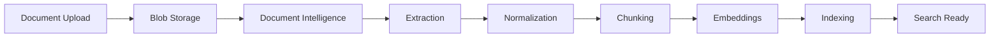
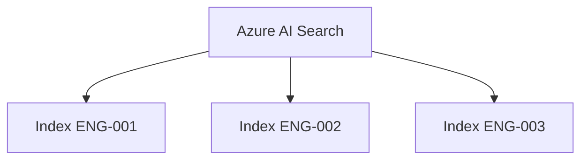
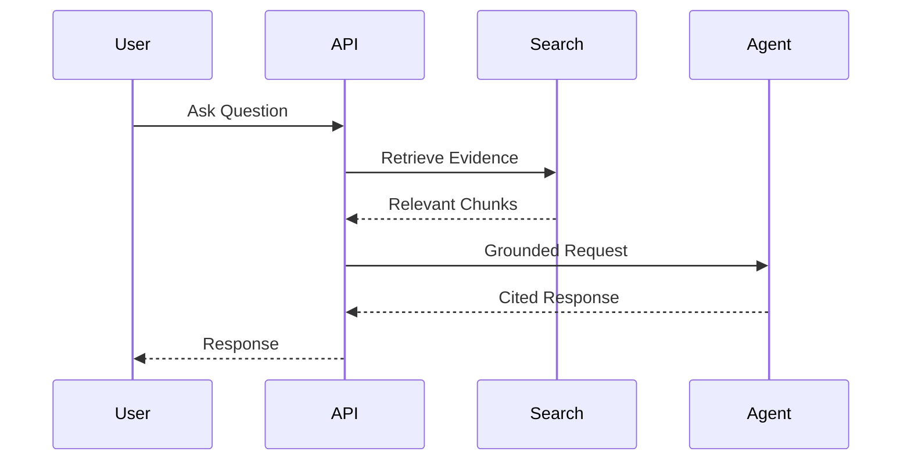
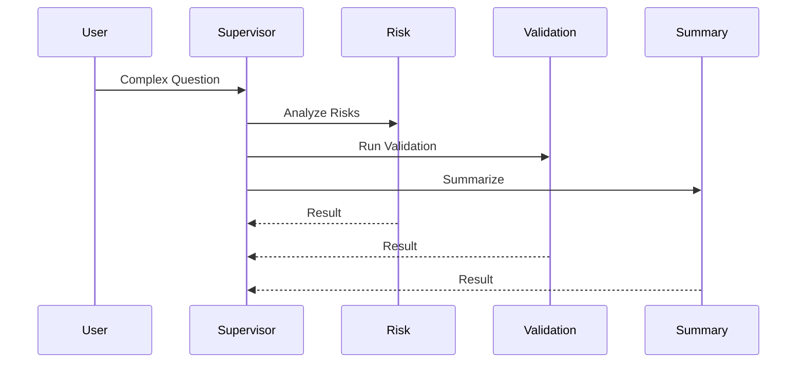
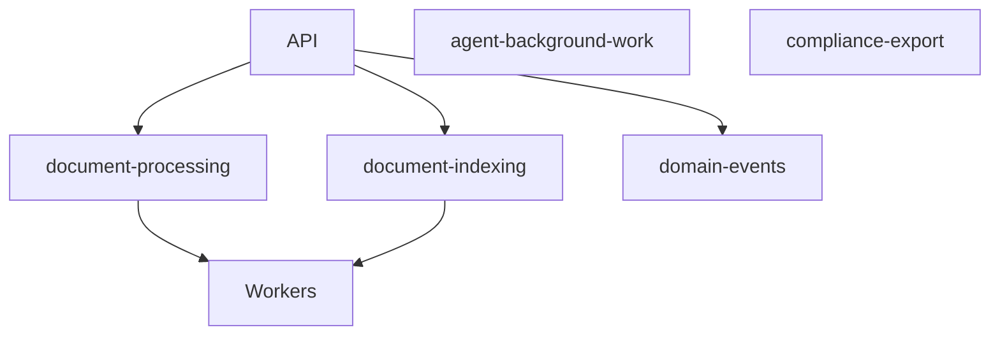

# Module 2 – Building Blocks

## Status
Accepted

---

# 1. Purpose

This module defines the primary architectural building blocks that implement the Audit Workspace solution. It converts business capabilities into deployable components, runtime services, storage systems, communication mechanisms, and governance-aware AI capabilities.

The architecture follows:

- Modular Monolith First
- Azure Container Apps deployment
- Governed multi-agent architecture
- Retrieval-Augmented Generation (RAG)
- Human-in-the-loop decision making
- Evidence traceability
- Audit defensibility

---

# 2. High-Level Building Block Architecture

---

# 3. Deployable Units

## Audit Workspace Web

Technology:

- React
- Next.js

Responsibilities:

- Audit Canvas
- Evidence viewing
- AI chat experience
- Review workflows
- Risk visualization
- Approval workflows

---

## Audit Workspace API

Technology:

- Python FastAPI
- Microsoft Agent Framework

Responsibilities:

- Authentication
- Authorization
- Agent orchestration
- Retrieval orchestration
- Governance enforcement
- Review APIs
- Search APIs

---

## Audit Workspace Worker

Same codebase as API.

Responsibilities:

- OCR processing
- Document extraction
- Chunking
- Embedding generation
- Search indexing
- Long-running workflows

---

# 4. Modular Monolith Structure

## Core Modules

### Identity & Access

Owns:

- Role assignments
- User authorization
- Access policies

### Engagement Workspace

Owns:

- Engagement metadata
- Workspace lifecycle

### Evidence Catalog

Owns:

- Evidence metadata
- Evidence versions
- Classification
- Provenance

### Audit Analysis

Owns:

- Facts
- Risks
- Findings
- Summaries

### Review & Approval

Owns:

- Reviews
- Approvals
- Decisions

---

# 5. Agent Building Blocks

## Agent Inventory

| Agent | Responsibility |
|---------|---------|
| Audit Q&A Agent | Grounded Q&A |
| Evidence Extraction Agent | Extract facts |
| Risk Detection Agent | Detect risks |
| Validation Agent | Validation support |
| Summary Agent | Summaries |
| Workflow Assistant Agent | Workflow guidance |
| Audit Q&A Supervisor | Complex orchestration |

---

## Agent Architecture

---

# 6. Data Architecture

## Authoritative Data Stores

### Azure Blob Storage

Stores:

- Financial statements
- Trial balances
- Ledgers
- Invoices
- Receipts
- Audit evidence

Role:

**Authoritative evidence repository**.

---

### Azure Cosmos DB

Stores:

- Facts
- Workflow memory
- Conversation memory
- Agent execution memory
- Agent registry

Role:

Application operational state.

---

## Derived Data Stores

### Azure AI Search

Stores:

- Chunks
- Embeddings
- Search documents

Role:

Derived and rebuildable retrieval layer.

---

# 7. Document Processing Pipeline

---

# 8. Retrieval Architecture

Decision:

**Index Per Engagement**

Benefits:

- Engagement isolation
- Easier retention
- Easier governance
- Reduced leakage risk

---

# 9. Runtime Flows

## Audit Question Flow

---

## Complex Audit Q&A

---

# 10. Messaging Architecture

## Azure Service Bus Topology

---

# 11. Security Building Blocks

- Microsoft Entra ID
- RBAC + ABAC
- Managed Identity
- Azure Key Vault
- Private Endpoints
- Customer Managed Keys
- Audit Trail
- Tool Gateway Authorization

---

# 12. Observability Building Blocks

Trace Context:

- CorrelationId
- CausationId
- TraceId
- EngagementId
- AgentVersion
- WorkflowVersion

Monitoring:

- API Latency
- Search Latency
- Agent Executions
- Cost
- Token Usage
- Queue Depth

---

# 13. Human Review Gates

Mandatory approval required for:

- Findings
- Conclusions
- Publication
- Retention Exceptions
- Governance Exceptions

No self-approval permitted.

---

# 14. Key Architecture Decisions

- Azure Container Apps
- Azure Blob Storage authority
- Azure Cosmos DB operational state
- Azure Service Bus Premium
- Index-per-engagement
- Local governed agents
- Conditional supervisor
- Human review required

---

# 15. Risks

| Risk | Mitigation |
|--------|---------|
| Agent sprawl | Registry governance |
| Search drift | Rebuildable indexes |
| Retrieval degradation | Evaluation framework |
| Prompt injection | Tool gateway and policy controls |
| Queue backlog | Autoscaling and backpressure |

---

# 16. Acceptance Checklist

- [x] Deployables accepted
- [x] Module decomposition accepted
- [x] Agent architecture accepted
- [x] Data architecture accepted
- [x] Search architecture accepted
- [x] Messaging architecture accepted
- [x] Security building blocks accepted
- [x] Review gates accepted

---

# Module Status

Accepted.
