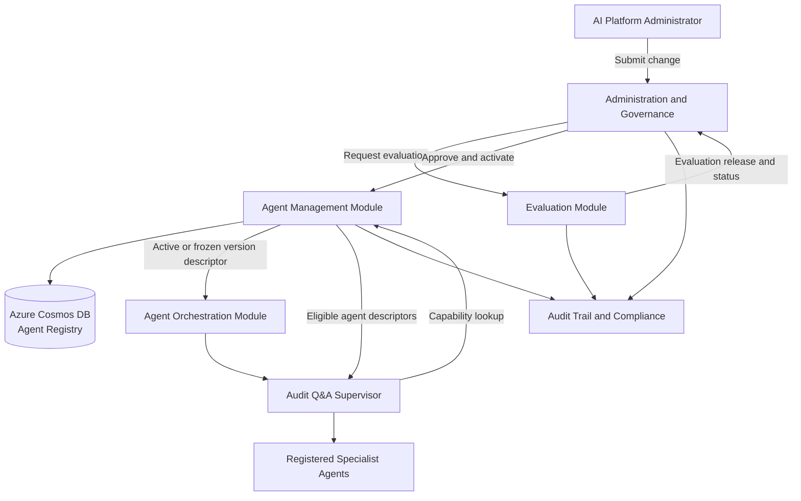
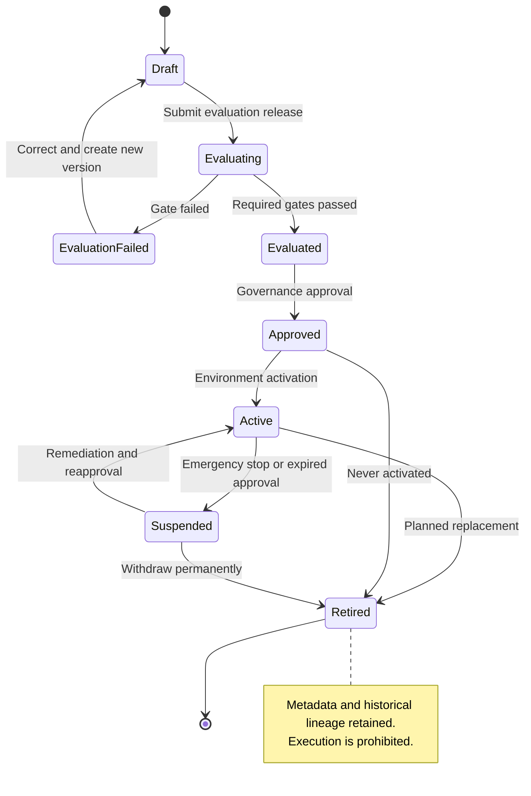
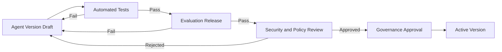
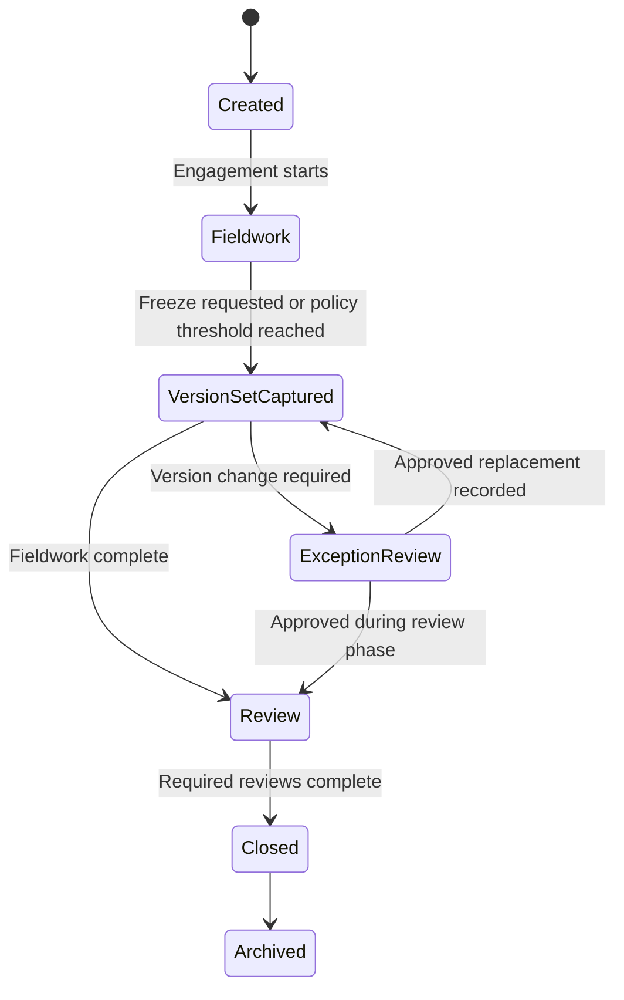
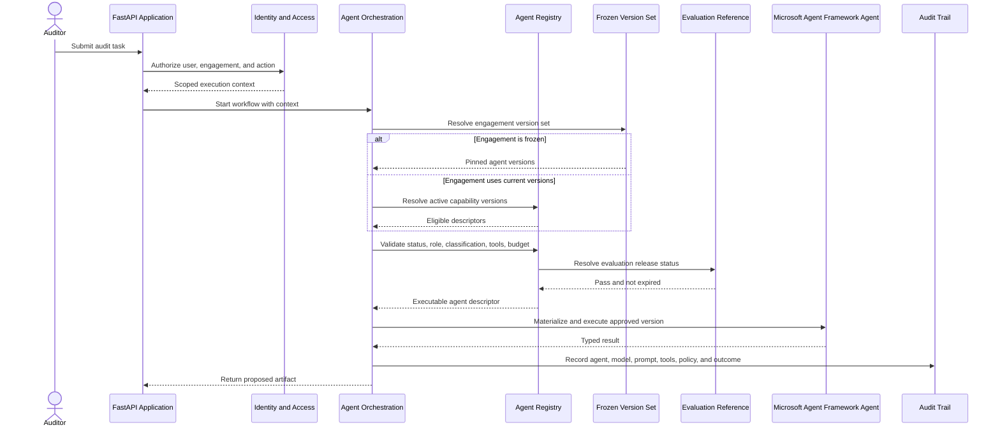
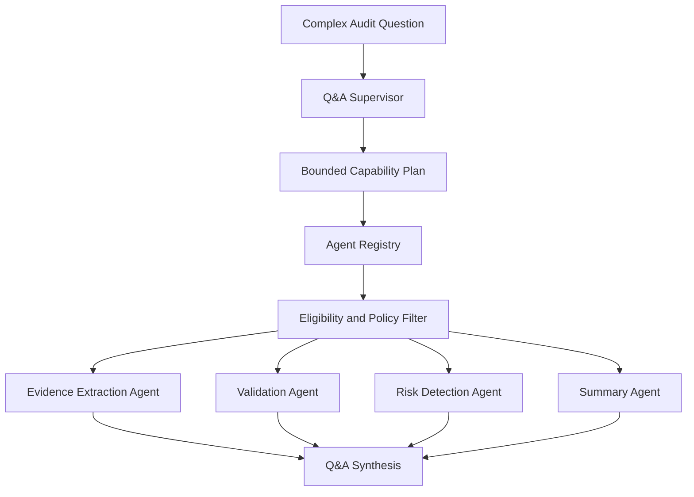
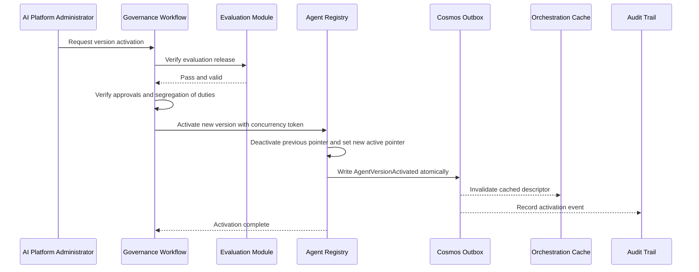

# Module 4 – Agent Registry

## Document Information

| Property | Value |
|---|---|
| Document | Audit Workspace Technical Architecture |
| Module | 04 – Agent Registry |
| Status | Accepted |
| Registry owner | Agent Management module |
| Registry store | Azure Cosmos DB |
| Agent runtime | Microsoft Agent Framework for Python |
| Model and AI platform | Microsoft Foundry |

---

## 1. Purpose

This module defines the governed Agent Registry for Audit Workspace. The registry is the authoritative inventory of logical agents that the application may execute. It prevents agent selection, prompts, models, tools, budgets, and lifecycle status from being scattered through application code.

The registry establishes:

- Stable agent identity and immutable versions
- Capability-based discovery
- Production activation controls
- Model, prompt, tool, retrieval, and budget bindings
- Evaluation and governance gates
- Engagement-level frozen version sets
- Auditability and rollback
- A future local-to-remote extraction seam

The registry does **not** grant business authority. Domain modules continue to own authorization, evidence, facts, validation outcomes, reviews, and approvals. A registry entry makes an agent technically eligible for selection; it does not permit that agent to approve an audit conclusion or bypass a domain rule.

---

## 2. Relevant Project Requirements

The Audit Workspace project defines six logical agents:

| Agent | Project responsibility |
|---|---|
| Audit Q&A Agent | Answers auditor questions using retrieved evidence |
| Evidence Extraction Agent | Extracts audit-relevant facts, amounts, dates, entities, and references |
| Risk Detection Agent | Highlights potential financial risks or inconsistencies |
| Validation Agent | Compares evidence against expected values or audit checks |
| Summary Agent | Generates document summaries and audit notes |
| Workflow Assistant Agent | Guides auditors through audit-review steps and required actions |

The project also requires:

- Versioned prompts and agent configurations
- Model usage monitoring
- Retrieval-quality and AI-response evaluation
- Controlled access to audit engagements
- Human review before conclusions are finalized
- Traceability among AI responses, source documents, users, and generated outputs
- Audit logging and enterprise security controls

All six agents are included in Release 1 as logical capabilities. They remain local to the modular-monolith runtime and do not become six independently deployed services.

---

## 3. Reference Architecture Guidance

The Microsoft Multi-Agent Reference Architecture uses an Agent Registry for agent discovery and lifecycle management. It describes registry storage as holding agent metadata, capabilities, versions, endpoints, security information, performance information, and operational history. It recommends access control, versioning, audit logging, backup, and query-efficient capability lookup.

Microsoft Agent Framework provides agents, graph and functional workflows, sessions, context providers, middleware, tool integrations, evaluation integrations, and Microsoft Foundry model-provider integration. Audit Workspace therefore maps the reference registry responsibility to an application-owned Agent Management module rather than treating a framework object or prompt file as the system of record.

Key interpretation rules are:

1. Registry metadata is application-owned.
2. Microsoft Agent Framework is the execution framework.
3. Microsoft Foundry provides approved model access and platform capabilities.
4. Agent selection remains policy constrained.
5. Discovered tools are not automatically authorized.
6. A remote endpoint is optional future metadata, not an initial deployment requirement.

---

## 4. Mapping to Audit Workspace

| Reference concept | Audit Workspace mapping | Decision | Rationale |
|---|---|---:|---|
| Agent Registry | Agent Management module | Adopt | Central inventory and lifecycle authority |
| Registry storage | Cosmos DB registry container | Adapt | Document-shaped definitions and versioned metadata |
| Capability catalog | Versioned capability declarations | Adopt | Supports supervisor and workflow lookup |
| Dynamic service mesh | Internal registry lookup | Adapt | No agent network or separate service mesh initially |
| Local agents | Microsoft Agent Framework instances in FastAPI runtime | Adopt | Fits modular-monolith constraint |
| Remote agents | Optional future execution target | Defer | No initial isolation or scaling requirement |
| Automatic activation | Governance-controlled activation | Reject | Production use requires evaluation and approval |
| Embedded credentials | Managed identity and secret references | Reject | Registry never stores reusable secrets |
| Multiple active production versions | One active version per agent per environment | Reject | Reduces behavioral ambiguity |
| Historical replay through retired agents | Stored lineage and artifacts | Reject | Retired agents are never executable |
| Evaluation ownership | Evaluation-owned, registry-linked | Adapt | Keeps benchmark data outside registry while enforcing gates |
| Engagement version pinning | Frozen Agent Version Set | Adopt | Supports regulated and long-running audit reproducibility |

---

## 5. Proposed Design

### 5.1 Registry context



### 5.2 Ownership and boundaries

The **Agent Management module** owns:

- Agent identity
- Agent version
- Capability definitions
- Prompt and instruction references
- Model policies
- Tool grants
- Retrieval profiles
- Execution budgets
- Evaluation references
- Lifecycle status
- Activation history
- Rollback references
- Local or future remote execution descriptors

The module does not own:

- Prompt source content where a dedicated Prompt Governance repository is used
- Evaluation datasets or detailed evaluation results
- Model deployments
- Domain authorization policy
- Engagement membership
- Evidence access
- Human approvals of audit artifacts
- Agent execution state

Other modules may read registry information only through the registry interface. Direct Cosmos DB container access is prohibited.

### 5.3 Cosmos DB design

#### Database and containers

Recommended logical design:

```text
Database: audit-workspace-ai-governance

Containers:
- agentDefinitions
- agentVersionSets
- registryOutbox
```

A consolidated `agentDefinitions` container stores one immutable document per agent version. The logical agent identity and its environment activation pointer are represented separately so activation does not mutate an immutable version document.

#### Partitioning

Recommended partition keys:

```text
agentDefinitions: /agentId
agentVersionSets: /engagementId
registryOutbox: /aggregateId
```

This supports:

- Efficient retrieval of all versions of one agent
- Atomic handling of an agent activation and its outbox event when stored in the same logical partition
- Efficient retrieval of the frozen version set for an engagement

#### Consistency

- Use session consistency for normal registry reads.
- Use an optimistic concurrency token for activation-pointer updates.
- Orchestration caches active descriptors only for a short bounded period.
- Activation and suspension events invalidate relevant caches.
- Consequential executions re-resolve the engagement’s frozen version set rather than relying only on a process cache.

### 5.4 Stable identities

Logical identities are permanent:

| Agent | Stable ID |
|---|---|
| Audit Q&A Agent | `AGT-QNA` |
| Evidence Extraction Agent | `AGT-EXTRACT` |
| Risk Detection Agent | `AGT-RISK` |
| Validation Agent | `AGT-VALIDATE` |
| Summary Agent | `AGT-SUMMARY` |
| Workflow Assistant Agent | `AGT-WORKFLOW` |
| Audit Q&A Supervisor | `AGT-QNA-SUPERVISOR` |

Version identifiers are immutable. Semantic versioning is recommended:

```text
Major: breaking input/output, behavior, capability, or policy change
Minor: backward-compatible capability or quality change
Patch: backward-compatible defect or instruction correction
```

Every change still requires evaluation and governed release; a patch version is not exempt from controls.

### 5.5 Registry metadata model

Each immutable agent-version document contains at least:

| Category | Attributes |
|---|---|
| Identity | `agentId`, `agentVersion`, `displayName`, `description` |
| Ownership | `businessOwner`, `technicalOwner`, `riskOwner` |
| Lifecycle | `status`, `createdAt`, `approvedAt`, `effectiveFrom`, `retiredAt` |
| Capabilities | Capability codes, task descriptions, dependency constraints |
| Contracts | Input schema, output schema, schema versions |
| Instructions | Instruction-set ID, version, content hash |
| Models | Model-policy ID, allowed deployment classes, fallback policy |
| Tools | Tool IDs, versions, allowed operations, confirmation requirements |
| Retrieval | Retrieval-profile ID, allowed indexes, filters, result and context limits |
| Security | Allowed classifications, permitted roles, region constraints |
| Execution | Time, token, cost, iteration, concurrency, and tool-call budgets |
| Human review | Review policy and consequential-action restrictions |
| Evaluation | Evaluation release ID, status, expiry, approved exceptions |
| Deployment | Local runtime by default; optional approved remote descriptor |
| Rollback | Previous approved version and rollback compatibility |
| Audit | Change request, approval record, reason, correlation ID |

Representative synthetic document:

```json
{
  "id": "AGT-QNA:2.1.0",
  "agentId": "AGT-QNA",
  "agentVersion": "2.1.0",
  "status": "Active",
  "capabilities": ["answer_audit_question", "synthesize_cited_evidence"],
  "inputSchemaVersion": "1.2",
  "outputSchemaVersion": "1.1",
  "instructionSet": {
    "id": "INS-QNA",
    "version": "5.0",
    "hash": "synthetic-sha256"
  },
  "modelPolicyId": "MODEL-POLICY-QNA-3",
  "toolGrants": [
    {"toolId": "RetrieveEvidence", "version": "2", "operations": ["read"]},
    {"toolId": "ResolveCitation", "version": "1", "operations": ["read"]}
  ],
  "retrievalProfileId": "RET-QNA-4",
  "allowedClassifications": ["Confidential-Audit"],
  "allowedRoles": ["Auditor", "AuditManager", "ComplianceReviewer"],
  "executionBudget": {
    "maximumSeconds": 60,
    "maximumInputTokens": 30000,
    "maximumOutputTokens": 4000,
    "maximumToolCalls": 6,
    "maximumEstimatedCost": "policy-defined"
  },
  "evaluation": {
    "evaluationReleaseId": "EVAL-QNA-2026-0042",
    "status": "Pass",
    "expiresAt": "2027-02-28T00:00:00Z"
  },
  "executionTarget": {"type": "Local"},
  "rollbackVersion": "2.0.2"
}
```

The document contains no API key, access token, connection string, or reusable credential.

### 5.6 Capability catalog

Capabilities are stable semantic codes, not free-form descriptions used as the sole routing mechanism.

| Agent | Initial capability codes |
|---|---|
| Audit Q&A | `answer_audit_question`, `synthesize_cited_evidence` |
| Evidence Extraction | `extract_audit_facts`, `anchor_extracted_values` |
| Risk Detection | `identify_financial_risks`, `identify_evidence_gaps` |
| Validation | `coordinate_validation`, `explain_validation_result` |
| Summary | `summarize_document`, `summarize_engagement_evidence` |
| Workflow Assistant | `recommend_next_workflow_action`, `explain_workflow_state` |
| Q&A Supervisor | `decompose_complex_audit_question`, `coordinate_specialists` |

A capability lookup must also apply:

- Environment
- Agent status
- Engagement’s frozen version set
- User role
- Data classification
- Region
- Evaluation validity
- Tool availability
- Runtime health
- Budget policy

Capability matching is therefore a policy-constrained query, not simply `capability -> agent`.

### 5.7 Lifecycle



#### Lifecycle rules

- **Draft:** Editable through a new draft revision; not executable.
- **Evaluating:** Evaluation is in progress; not executable in production.
- **EvaluationFailed:** Cannot be approved.
- **Evaluated:** Required tests passed; still not production executable.
- **Approved:** Authorized for a named environment but not yet active.
- **Active:** Eligible for selection.
- **Suspended:** Immediately excluded from new executions.
- **Retired:** Historical metadata only; never executable.

Only one version of an agent can have `Active` status in a given environment.

### 5.8 Evaluation gate

Evaluation artifacts are **evaluation-owned and registry-linked**.

The Evaluation module owns:

- Benchmark datasets
- Test cases
- Ground truth
- Evaluator configuration
- Metric outputs
- Human adjudication
- Detailed evaluation reports

The registry stores:

- Evaluation release ID
- Gate outcome
- Evaluation timestamp
- Expiry timestamp
- Governed exception reference, if any

Activation gate:



A version cannot become active unless:

- Required software and contract tests pass
- Agent-specific quality gates pass
- Grounding and citation gates pass where applicable
- Safety and prompt-injection tests pass
- Tool-permission tests pass
- Cost and latency are within the approved envelope
- Human governance approval is recorded
- The evaluation has not expired

### 5.9 Single active version per environment

The registry enforces:

```text
At most one Active version
per agent
per environment
```

For example:

```text
Development: AGT-QNA 2.2.0 Active
Test:        AGT-QNA 2.2.0 Active
Production:  AGT-QNA 2.1.0 Active
```

Canary versions may exist in a distinct `Canary` or evaluation deployment state but are not treated as generally active. Canary traffic must be synthetic or explicitly approved and must not produce consequential audit decisions.

### 5.10 Frozen Agent Version Sets

Regulated or long-running engagements can freeze the exact agent versions used for execution.



A frozen version set contains:

```json
{
  "engagementId": "synthetic-engagement-id",
  "versionSetId": "AVS-2026-0042",
  "status": "Frozen",
  "agents": {
    "AGT-QNA": "2.1.0",
    "AGT-EXTRACT": "1.4.2",
    "AGT-RISK": "1.8.0",
    "AGT-VALIDATE": "1.3.1",
    "AGT-SUMMARY": "1.4.0",
    "AGT-WORKFLOW": "1.2.0",
    "AGT-QNA-SUPERVISOR": "1.1.0"
  },
  "capturedAtUtc": "2026-09-01T10:30:00Z",
  "policyVersion": "POL-AI-7",
  "approvedBy": ["synthetic-audit-manager", "synthetic-compliance-reviewer"]
}
```

Rules:

- New engagements initially use current active versions.
- Policy can freeze versions at fieldwork start, fieldwork completion, or formal review.
- A global activation does not silently change a frozen engagement.
- A security-critical suspension can stop a frozen version from executing.
- Replacing a frozen version requires a governed exception, impact assessment, reevaluation, and explicit version-set revision.
- Closed engagements retain the version-set record with their audit lineage.

### 5.11 Discovery and execution sequence



### 5.12 Supervisor integration

The Audit Q&A Supervisor never relies only on hard-coded agent names. It produces a bounded capability plan and asks the registry for eligible implementations.



The supervisor cannot:

- Activate an agent version
- Select a suspended or retired version
- Override a frozen version set
- Grant a new tool
- change the evidence scope
- exceed classification or region constraints
- approve an audit finding

### 5.13 Tool and model authorization

The registry controls the **maximum allowed** tool and model policy for an agent version. Runtime authorization can further restrict these grants.

Effective tool permission is:

```text
Registry grant
∩ invoking user permission
∩ engagement policy
∩ data classification policy
∩ workflow-step permission
∩ current tool availability
```

The registry does not contain credentials. Managed identity and approved secret references are resolved by infrastructure adapters at runtime.

Model policy includes:

- Approved Microsoft Foundry deployment class
- Region and data-boundary constraints
- Minimum and maximum model capability
- Fallback deployment
- Token, latency, and cost limits
- Prohibited data classifications
- Content-safety policy reference

### 5.14 Activation and rollback



Rollback:

- Selects the previous approved, nonretired version.
- Rechecks evaluation validity, security posture, model availability, and contract compatibility.
- Produces a new activation record; it does not delete history.
- Does not automatically alter frozen engagement version sets.
- Emergency rollback is allowed through an emergency governance path with mandatory post-incident review.

### 5.15 Retired agents and historical investigation

Retired agents are:

- Not executable
- Not returned by normal discovery
- Not eligible for rollback
- Retained as metadata for lineage

Historical investigation uses:

- Stored generated artifact
- Input and output schema references
- Evidence and fact versions
- Agent, prompt, model, workflow, tool, and policy versions
- Evaluation release
- Execution trace and audit record

Audit Workspace does not claim that rerunning an old agent would reproduce an identical result because models, dependencies, tools, and indexes can change.

### 5.16 Security and observability

Security controls:

- Cosmos DB access through managed identity
- Read and write identities separated
- Registry write available only through governance APIs
- No direct production editing
- Private connectivity in production
- Customer-managed encryption keys where approved
- Optimistic concurrency for activation
- Privileged administration through just-in-time access
- Every activation, suspension, retirement, override, and frozen-set change audited

Observed fields:

- Agent ID and version
- Capability requested and selected
- Registry lookup latency
- Version-set ID
- Evaluation release and expiry
- Tool and model policy IDs
- Activation source and cache version
- Discovery exclusion reason
- Rollback and suspension events
- Correlation, causation, and trace identifiers

Sensitive instruction content and credentials are not written into general telemetry.

### 5.17 Failure handling

| Failure | Required behavior |
|---|---|
| Registry unavailable | Fail closed for new agent execution; deterministic non-AI features may continue |
| Active version missing | Return governed configuration failure; do not select a draft or retired version |
| Evaluation expired | Suspend new execution until reevaluated or formally excepted |
| Frozen version suspended | Stop execution and create governance review; never silently substitute |
| Capability has multiple eligible agents | Apply explicit selection policy; if still ambiguous, stop rather than choose nondeterministically |
| Cosmos concurrency conflict | Reload current activation pointer and retry the governance command with operator-visible conflict handling |
| Prompt/model/tool reference missing | Mark version nonexecutable and alert |
| Cache is stale | Activation event invalidates cache; consequential execution revalidates registry descriptor |
| Rollback version unavailable | Maintain suspension and use deterministic fallback workflow where possible |

### 5.18 Extraction readiness

The registry descriptor reserves an execution-target abstraction:

```text
Local
RemoteManaged
RemoteContainer
```

Release 1 uses only `Local`.

Extraction requires:

- Documented scaling, isolation, ownership, or technology trigger
- Network identity and authorization
- Versioned remote contract
- Timeout, retry, circuit-breaker, and health semantics
- Distributed tracing
- Independent release and operations ownership
- Verification that the remote boundary does not broaden evidence access

Changing the execution target must not require changing the agent’s logical identity or capability code.

---

## 6. Design Decisions and Trade-offs

### ADR-036 – Centralized Agent Registry

- **Status:** Accepted
- **Decision:** Agent Management is the sole registry authority.
- **Rationale:** Central governance, discovery, and lineage.
- **Consequence:** Registry availability becomes necessary for new agent execution.

### ADR-037 – Immutable Agent Versions

- **Status:** Accepted
- **Decision:** Activated versions are immutable; any change creates a new version.
- **Rationale:** Reproducibility and defensible rollback.
- **Consequence:** More version records and release discipline.

### ADR-038 – Capability-Based Discovery

- **Status:** Accepted
- **Decision:** Workflows request capabilities and apply registry eligibility policy.
- **Rationale:** Reduces hard-coded implementation coupling.
- **Consequence:** Capability taxonomy requires governance.

### ADR-039 – Evaluation Before Activation

- **Status:** Accepted
- **Decision:** Activation requires a valid passing evaluation release.
- **Rationale:** Prevents unevaluated behavior from entering production.
- **Consequence:** Release lead time and evaluation maintenance increase.

### ADR-040 – Registry-Bounded Tool Grants

- **Status:** Accepted
- **Decision:** Each version has explicit maximum tool grants.
- **Rationale:** Least privilege and predictable evaluation.
- **Consequence:** Adding a tool requires a new evaluated version.

### ADR-041 – Registry-Bounded Model Policy

- **Status:** Accepted
- **Decision:** Agent versions reference approved model policies, not arbitrary deployments.
- **Rationale:** Controls geography, quality, cost, and fallback.
- **Consequence:** Model-policy governance becomes an operational dependency.

### ADR-042 – Supervisor Uses Registry Lookup

- **Status:** Accepted
- **Decision:** The supervisor resolves agents through capability and policy lookup.
- **Rationale:** Supports controlled evolution.
- **Consequence:** Supervisor plans must use governed capability codes.

### ADR-043 – Cosmos DB Registry Store

- **Status:** Accepted
- **Decision:** Use Azure Cosmos DB for agent definitions, activation pointers, and frozen version sets.
- **Rationale:** Versioned definitions are document-shaped and queryable by agent identity.
- **Consequence:** Partitioning, consistency, and change-feed outbox behavior require careful design.

### ADR-044 – Retired Agents Are Non-executable

- **Status:** Accepted
- **Decision:** Retain metadata and lineage but prohibit execution.
- **Rationale:** Historical rerun cannot guarantee reproducibility and can revive unsafe dependencies.
- **Consequence:** Investigation relies on stored artifacts and lineage.

### ADR-045 – Evaluation-Owned, Registry-Linked

- **Status:** Accepted
- **Decision:** Evaluation owns datasets and detailed results; registry stores immutable references and gate status.
- **Rationale:** Clear separation of concern.
- **Consequence:** Activation depends on evaluation-reference availability and integrity.

### ADR-046 – One Active Version Per Environment

- **Status:** Accepted
- **Decision:** Only one generally active version of an agent is permitted per environment.
- **Rationale:** Reduces behavioral ambiguity and simplifies audit explanation.
- **Consequence:** Canary testing uses a separate controlled state and traffic policy.

### ADR-047 – Engagement-Level Frozen Version Sets

- **Status:** Accepted
- **Decision:** Regulated and policy-defined engagements pin exact agent versions.
- **Rationale:** Prevents silent behavioral change during audit execution or review.
- **Consequence:** Security suspension may require governed replacement of a frozen version.

---

## 7. Diagrams Index

This module includes:

1. Registry context diagram
2. Agent lifecycle state diagram
3. Evaluation and activation gate
4. Frozen engagement version-set lifecycle
5. Agent discovery and execution sequence
6. Supervisor capability-resolution flow
7. Activation and cache-invalidation sequence

---

## 8. Risks and Mitigations

| ID | Risk | Likelihood | Impact | Mitigation | Owner placeholder | Residual risk |
|---|---|---:|---:|---|---|---|
| REG-R01 | Unauthorized production activation | Low | Critical | Governance command, just-in-time admin, segregation of duties, immutable audit event | AI Governance Owner | Low |
| REG-R02 | Agent sprawl and overlapping capabilities | Medium | High | Capability review, ownership, overlap evaluation, retirement policy | AI Architect | Medium |
| REG-R03 | Stale cache selects previous version | Medium | High | Activation events, bounded cache, revalidation for consequential workflows | Platform Lead | Low–Medium |
| REG-R04 | Frozen engagement uses a vulnerable agent | Low | Critical | Suspension overrides execution; governed replacement and impact assessment | Security Owner | Medium |
| REG-R05 | Cosmos partition design prevents atomic activation outbox | Medium | High | Co-locate aggregate and outbox with tested partition key policy | Data Architect | Low–Medium |
| REG-R06 | Evaluation reference is deleted or altered | Low | High | Immutable evaluation release, retention, integrity checks | Evaluation Owner | Low |
| REG-R07 | Registry contains credentials | Low | Critical | Schema prohibition, secret scanning, managed identity, security review | Security Owner | Low |
| REG-R08 | Capability lookup returns an unauthorized agent | Medium | Critical | Role, classification, region, frozen-set, and tool policy filtering | Agent Management Owner | Low |
| REG-R09 | New version changes typed contract unexpectedly | Medium | High | Semantic versioning, contract tests, compatibility checks | Engineering Lead | Low–Medium |
| REG-R10 | Rollback selects an expired or incompatible version | Medium | High | Recheck evaluation, model, tool, and contract status before rollback | AI Platform Administrator | Low |
| REG-R11 | Retired version is accidentally executable | Low | High | Runtime allow-list supports only Active or exact permitted frozen versions; retired hard deny | Engineering Lead | Low |
| REG-R12 | One active version prevents controlled experimentation | Medium | Medium | Separate canary state using synthetic or explicitly approved traffic | Evaluation Owner | Low |

---

## 9. Assumptions and Open Questions

### 9.1 Resolved assumptions

| Item | Resolution |
|---|---|
| Registry store | Azure Cosmos DB |
| Retired agent execution | Prohibited |
| Evaluation ownership | Evaluation-owned and registry-linked |
| Active versions | One active version per agent per environment |
| Regulated engagement behavior | Supports frozen Agent Version Sets |
| Release 1 agent count | Six specialist agents plus conditional Q&A Supervisor |
| Runtime placement | Local in modular monolith |
| Framework version | Latest stable approved release, pinned to exact package version |

### 9.2 Remaining validation items

1. Confirm the Cosmos DB account, geography, availability, and backup configuration.
2. Validate partition keys and transactional batches with the concrete registry repository implementation.
3. Confirm the exact stable Microsoft Agent Framework Python package version at implementation baseline.
4. Confirm evaluation-expiry policy; the current architecture baseline is 180 days.
5. Define formal business, technical, and risk owners for every agent.
6. Define which engagement types require immediate version freezing versus freezing at fieldwork completion.
7. Confirm whether canary testing may use anonymized production-like data or synthetic data only.

---

## 10. Portfolio Value

This module demonstrates:

- Governed multi-agent lifecycle architecture
- Capability-based discovery without premature service mesh complexity
- Cosmos DB document and partition design
- Immutable configuration and reproducible releases
- Evaluation-gated production activation
- Least-privilege tool and model binding
- Supervisor-to-registry integration
- Regulated-engagement version freezing
- Emergency suspension and rollback design
- Audit lineage without unsafe historical re-execution
- Local-to-remote extraction readiness

---

## 11. Review Checkpoint

### Accepted decisions

- [x] Agent Management owns the centralized registry.
- [x] Azure Cosmos DB stores agent versions and frozen version sets.
- [x] Agent versions are immutable.
- [x] Capability-based discovery is policy constrained.
- [x] Evaluation artifacts are evaluation-owned and registry-linked.
- [x] Evaluation pass and governance approval are required before activation.
- [x] Only one agent version is active per environment.
- [x] Retired agents are never executable.
- [x] Regulated engagements can freeze exact agent versions.
- [x] The Q&A Supervisor resolves specialists through the registry.
- [x] Registry tool grants are maximum permissions, not final authorization.
- [x] Credentials are excluded from registry metadata.
- [x] Release 1 agents execute locally in the modular monolith.
- [x] Future remote execution uses a transport abstraction and explicit extraction criteria.

### Appendix updates

- ADR Log: ADR-036 through ADR-047
- Assumption Register: registry store, runtime, versioning, evaluation, and frozen-set decisions
- Risk Register: REG-R01 through REG-R12
- Component Inventory: Agent Management, Cosmos registry containers, Q&A Supervisor, six specialist agents
- Governance Matrix: agent change, evaluation, approval, activation, suspension, rollback, and retirement responsibilities
- Open Questions: remaining implementation validation items above

---

## Source References

- Audit Workspace Solution Design Document, sections 5, 8.5, 12, 13, 14, 15, 16, and 19.
- Microsoft Multi-Agent Reference Architecture, Reference Architecture: Agent Registry, Supervisor Agent, local and remote agents, registry storage, and integration controls.
- Microsoft Agent Framework Overview: agents, workflows, sessions, context providers, middleware, tool integration, evaluation integration, and Microsoft Foundry provider support.
