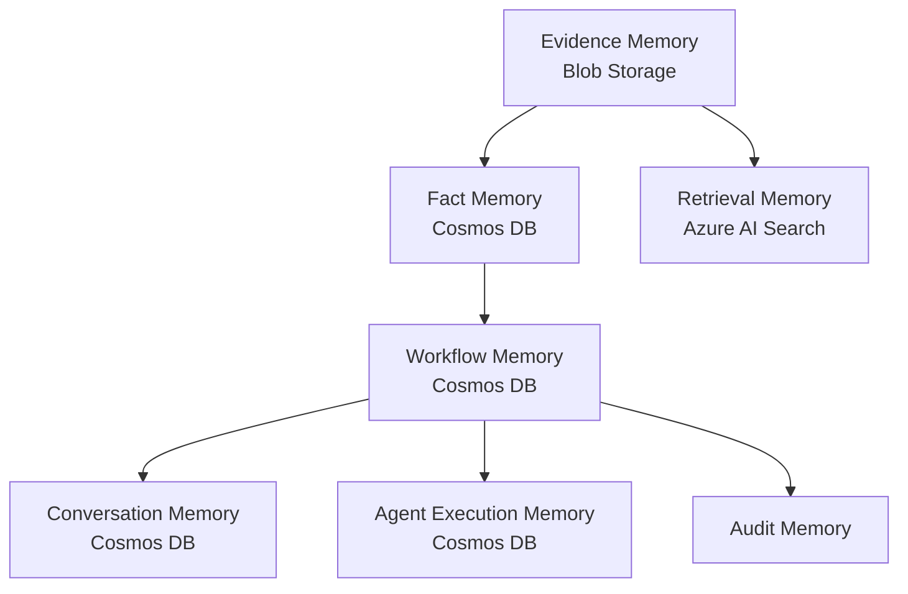
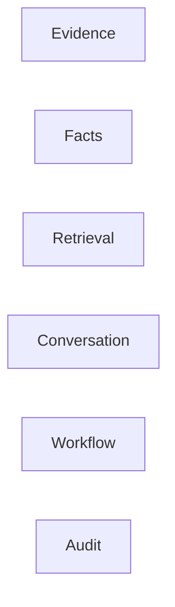
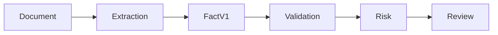
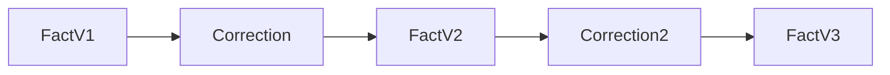
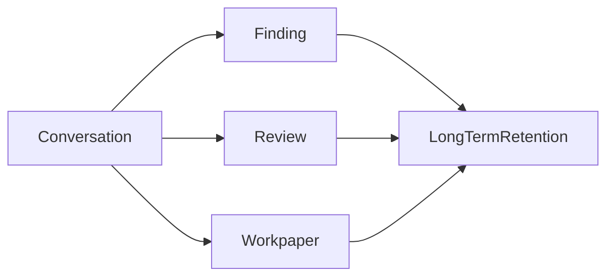
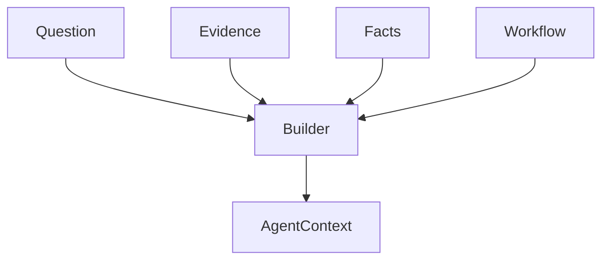
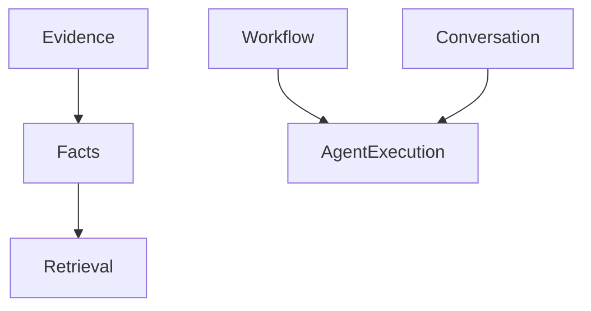
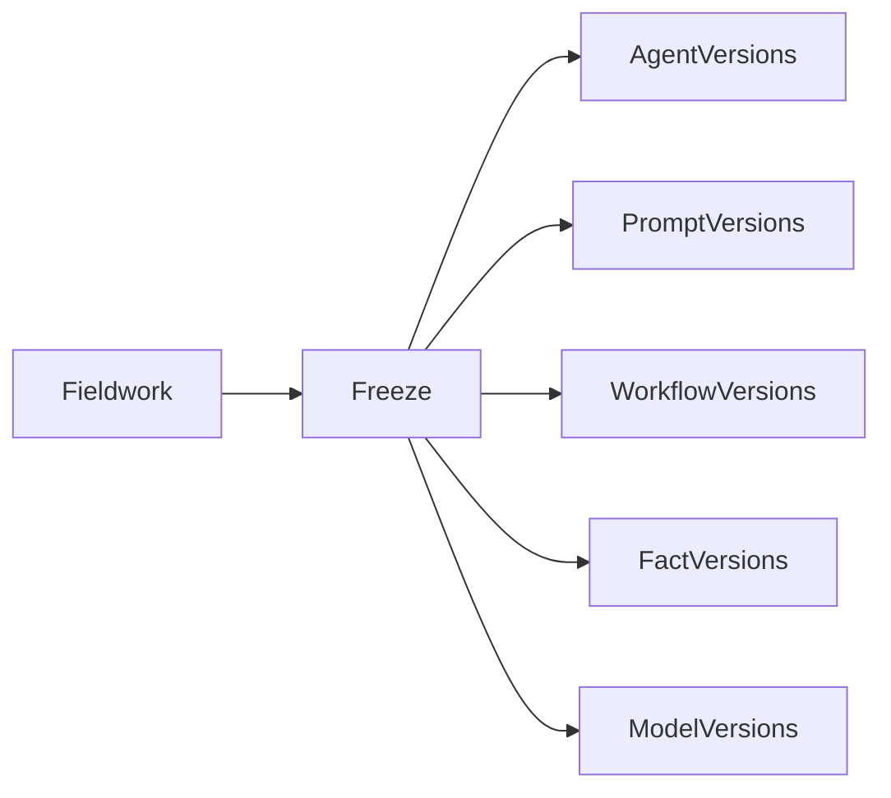
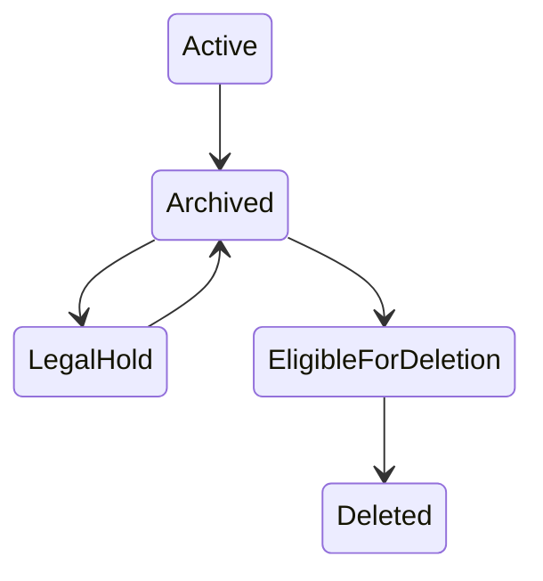
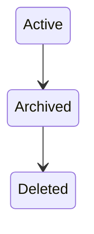

# Module 5 – Memory

## Status
Accepted

---

# 1. Purpose

This module defines the Memory Architecture for Audit Workspace.

The platform must preserve:

- Evidence
- Facts
- Validation Results
- Risk Assessments
- Workflow State
- Agent State
- Conversation History
- Review History
- Execution Lineage

while maintaining:

- Traceability
- Reproducibility
- Governance
- Retention Policies
- Legal Hold
- Least Privilege

The memory architecture adopts **Domain-Governed Memory** (ADR-048) and stores operational memory in Azure Cosmos DB while keeping evidence authoritative in Azure Blob Storage.

---

# 2. Memory Architecture Overview



---

# 3. Memory Domains

Audit Workspace uses six governed memory domains.



Each domain has:

- Separate ownership
- Separate retention
- Separate security
- Separate lifecycle

---

# 4. Evidence Memory

## Purpose

Stores authoritative audit evidence:

- Financial statements
- Trial balances
- Invoices
- Receipts
- Ledgers
- Bank statements

Project requirements explicitly identify these document types. citeturn32search30

## Store

Azure Blob Storage

## Characteristics

- Immutable
- Versioned
- Retention controlled
- Legal hold supported

## Memory Type

Long-term authoritative memory.

---

# 5. Fact Memory

## Store

Azure Cosmos DB

Accepted replacement for operational audit facts.

## Purpose

Stores structured audit data:

- Revenue
- Expense
- Vendor
- Invoice Number
- Bank Balance
- Ledger Reference

## Fact Lineage



## Independent Versioning

ADR-054

Facts are versioned independently from evidence.

Example:

```text
Evidence v1
  -> Fact v1
  -> Fact v2
  -> Fact v3
```

---

# 6. Fact Corrections

ADR-055

Fact corrections never update existing facts.



Audit Workspace uses:

```text
Append-only version history
```

Benefits:

- Traceability
- Explainability
- Reviewability

---

# 7. Retrieval Memory

## Store

Azure AI Search

## Contents

- Chunks
- Embeddings
- Semantic metadata
- Search documents

## Characteristics

```text
Derived
Rebuildable
Non-authoritative
```

ADR-051

---

# 8. Conversation Memory

## Store

Azure Cosmos DB

## Contents

- User messages
- Agent responses
- Session context

## Retention

180 Days

unless legal hold applies.

---

## Conversation Promotion Rule



Ordinary conversations expire.

Referenced conversations become governed records.

---

# 9. Workflow Memory

## Store

Azure Cosmos DB

## Purpose

Stores:

- Current step
- Completed step
- Review state
- Approval state
- Workflow checkpoints

Example document:

```json
{
  "workflowId": "WF-001",
  "status": "WaitingForReview",
  "nextStep": "ManagerApproval"
}
```

ADR-057

Workflow state is archived for all engagements.

---

# 10. Agent Execution Memory

## Store

Azure Cosmos DB

Stores:

- Execution Id
- Session Id
- Agent Version
- Runtime State
- Checkpoints

## Retention

```text
7 Years   -> Audit-linked executions
180 Days  -> Ordinary executions
```

---

# 11. Audit Memory

## Purpose

Stores:

- Approvals
- Rejections
- Policy decisions
- Agent executions
- Tool usage
- Human review events

## Retention

7 Years

---

# 12. Agent Context Construction

Agents do not receive all memory.

Context Builder selects only:



Benefits:

- Smaller context windows
- Better security
- Lower cost

---

# 13. Memory Hierarchy



---

# 14. Memory Classification

| Domain | Classification |
|----------|----------|
| Evidence | Confidential Audit |
| Facts | Confidential Audit |
| Retrieval | Confidential Audit |
| Conversation | Internal / Confidential |
| Workflow | Internal |
| Agent State | Internal |
| Audit Memory | Restricted Audit |

---

# 15. Memory Security Controls

All memory stores enforce:

- Microsoft Entra ID
- RBAC
- Managed Identity
- Encryption
- Audit Trail

Project security requirements require identity, authorization, encryption and audit logging. citeturn32search30

---

# 16. Frozen Engagement Memory

ADR-053

When engagement enters review:



Purpose:

Reproducibility.

---

# 17. Legal Hold

ADR-056



Legal hold overrides:

- Retention expiration
- Deletion policies
- Archive cleanup

---

# 18. Memory Lifecycle



Operational simplification of governed lifecycle.

---

# 19. Design Decisions

| ADR | Decision |
|------|---------|
| ADR-048 | Domain-Governed Memory |
| ADR-049 | Evidence Memory Authoritative |
| ADR-050 | Fact Memory Separate from Search |
| ADR-051 | Search Memory Derived |
| ADR-052 | Temporary Conversation Retention |
| ADR-053 | Freeze Memory Contexts |
| ADR-054 | Independent Fact Versioning |
| ADR-055 | Fact Corrections Create New Versions |
| ADR-056 | Legal Hold Overrides Retention |
| ADR-057 | Archive Workflow State For All Engagements |

---

# 20. Risks and Mitigations

| Risk | Mitigation |
|--------|---------|
| Memory growth | Retention controls |
| Evidence duplication | Single authoritative store |
| Search drift | Rebuildable indexes |
| Agent overexposure | Context builder |
| Missing lineage | Fact ownership |
| Replay inconsistency | Frozen contexts |

---

# 21. Assumptions

Accepted assumptions:

- Azure Blob Storage remains authoritative evidence store.
- Azure Cosmos DB stores Fact Memory.
- Azure Cosmos DB stores Workflow Memory.
- Azure Cosmos DB stores Conversation Memory.
- Azure Cosmos DB stores Agent Execution Memory.
- Frozen engagement support enabled.

---

# 22. Acceptance Checklist

- [x] Memory domains accepted
- [x] Evidence memory accepted
- [x] Fact memory accepted
- [x] Retrieval memory accepted
- [x] Conversation strategy accepted
- [x] Workflow memory accepted
- [x] Fact versioning accepted
- [x] Legal hold accepted
- [x] Retention model accepted
- [x] Frozen memory accepted

---

# Module Status

Accepted.
