# Module 6 – Agent Communication

## Status
Accepted

---

# 1. Purpose

This module defines communication patterns for Audit Workspace across:

- Users
- Domain modules
- Agents
- Workflows
- Background workers
- External integrations

The design adopts a hybrid communication model combining:

- In-process commands
- In-process queries
- In-process domain events
- Microsoft Agent Framework workflows
- Server-Sent Events (SSE)
- Azure Service Bus Premium
- Transactional Outbox patterns

---

# 2. Communication Principles

1. Default to in-process communication.
2. Use durable messaging only when necessary.
3. Preserve correlation and causation.
4. Support at-least-once delivery.
5. Require idempotent consumers.
6. Preserve audit traceability.
7. Support future extraction of modules.

---

# 3. Communication Model

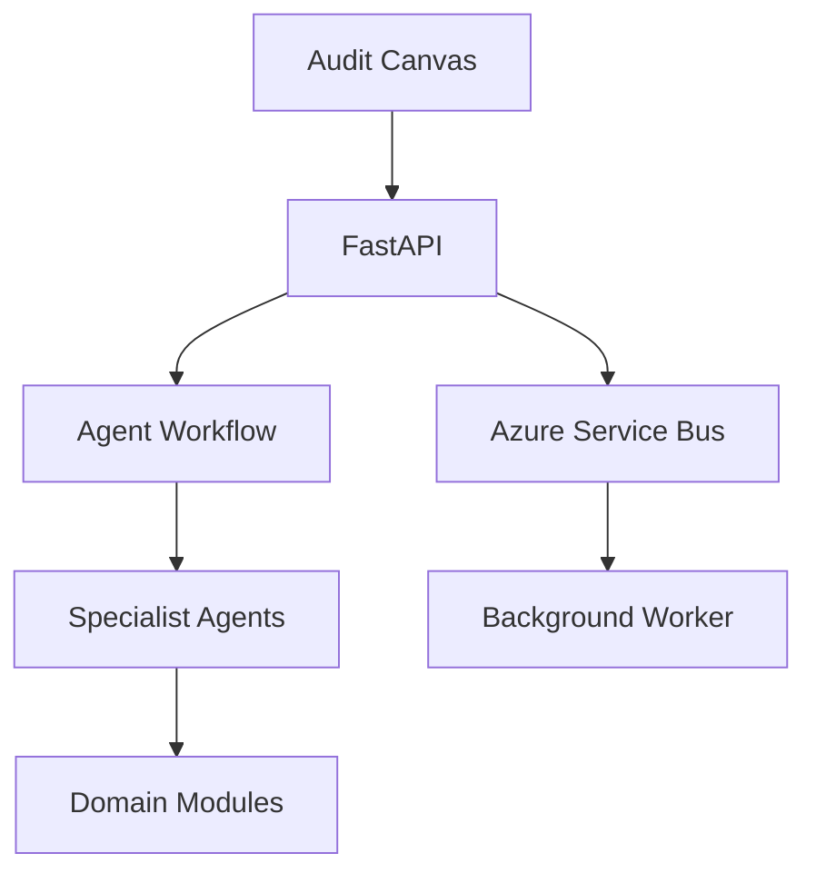

---

# 4. Communication Types

| Interaction | Pattern |
|---|---|
| User Request | HTTPS Command/Query |
| Internal State Change | Domain Event |
| Agent Collaboration | Agent Framework Workflow |
| Streaming Response | SSE |
| Durable Processing | Service Bus Queue |
| Multi Consumer Event | Service Bus Topic |

---

# 5. Commands, Queries and Events

## Commands

Examples:

- UploadEvidence
- RegisterEvidence
- SubmitArtifactForReview
- ApproveAuditArtifact

## Queries

Examples:

- RetrieveEvidence
- GetFactVersion
- ResolveCitation

## Events

Examples:

- EvidenceAcceptedForProcessing
- ProposedRiskCreated
- ArtifactApproved

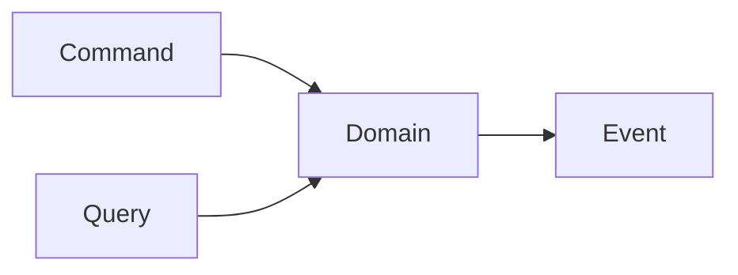

---

# 6. Agent Communication

Agents communicate using typed contracts.

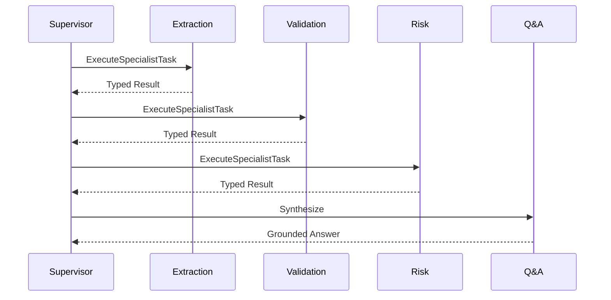

Agents never exchange unrestricted chat transcripts.

---

# 7. Streaming Model

Audit Q&A supports Server-Sent Events.

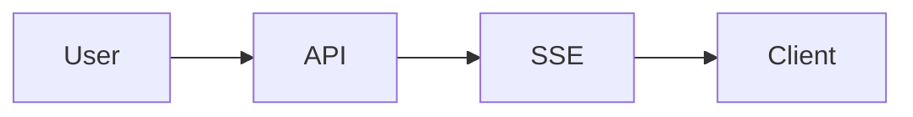

Event Types:

- execution.started
- retrieval.completed
- agent.started
- agent.completed
- citation.available
- answer.delta
- execution.completed
- execution.failed

---

# 8. Azure Service Bus Topology

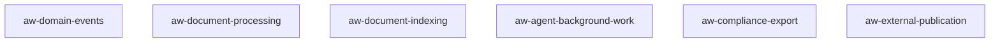

---

# 9. Transport Matrix

| Interaction | Transport |
|---|---|
| Browser → API | HTTPS |
| Q&A Streaming | SSE |
| Module Calls | In Process |
| Domain Events | In Process |
| Agent Workflow | Microsoft Agent Framework |
| Async Work | Azure Service Bus |

---

# 10. Standard Envelope

```json
{
  "messageId":"uuid",
  "messageType":"EvidenceAcceptedForProcessing",
  "correlationId":"C1",
  "causationId":"M1",
  "schemaVersion":"1.0"
}
```

Required:

- MessageId
- CorrelationId
- CausationId
- Classification
- PolicyVersion

---

# 11. Correlation Model

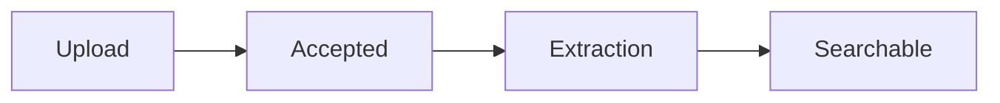

Each message preserves:

- CorrelationId
- TraceId
- CausationId

---

# 12. Transactional Outbox

## SQL Pattern

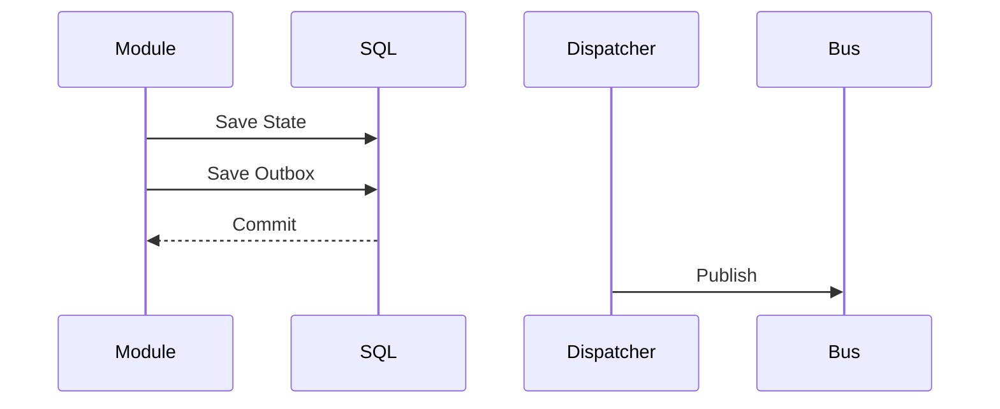

## Cosmos Pattern

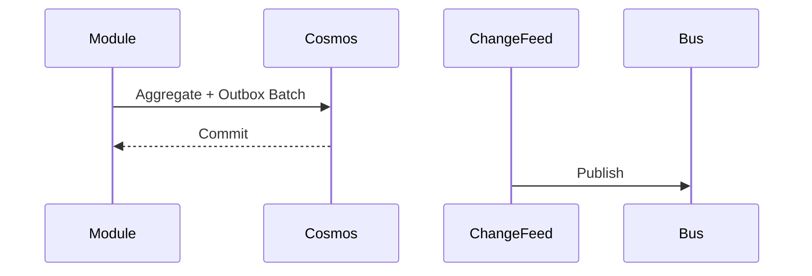

---

# 13. Delivery Semantics

Adopted:

```text
At-Least-Once Delivery
+
Idempotent Consumers
```

Exactly-once is not claimed.

---

# 14. Idempotency

Consumer Inbox Pattern:

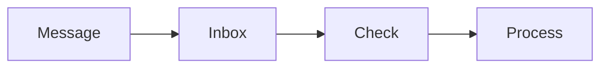

Examples:

- Evidence registration key
- Extraction key
- Indexing key
- Review decision key

---

# 15. Retry Policy

| Failure | Action |
|---|---|
| Network Error | Retry |
| Throttling | Retry |
| Authorization Failed | No Retry |
| Schema Failure | Dead Letter |
| Safety Rejection | Governed Failure |

---

# 16. Dead Letter Strategy

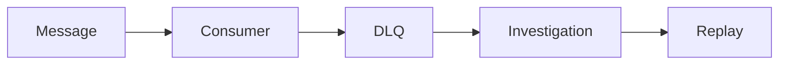

Replay requires authorization.

---

# 17. Message Catalog

Core Messages:

- MM-001 UploadEvidence
- MM-002 EvidenceAcceptedForProcessing
- MM-003 DocumentExtractionCompleted
- MM-004 IndexEvidence
- MM-005 EvidenceSearchable
- MM-006 AnswerAuditQuestion
- MM-007 ExecuteSpecialistTask
- MM-008 RunValidationRuleSet
- MM-009 ProposedRiskCreated
- MM-010 SubmitArtifactForReview
- MM-011 ApproveAuditArtifact
- MM-012 ArtifactApproved
- MM-013 AgentVersionActivated

---

# 18. Security Controls

- Managed Identity
- Classification-aware messaging
- No secrets in messages
- No evidence payloads in durable messages
- Tool reauthorization
- Audit logging

---

# 19. Evolution Path

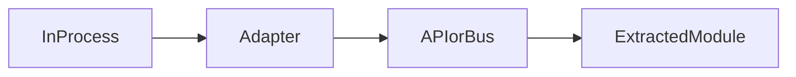

Logical contracts remain unchanged.

---

# 20. ADRs

| ADR | Decision |
|---|---|
| ADR-058 | Hybrid Communication Model |
| ADR-059 | Azure Service Bus Premium |
| ADR-060 | At-Least-Once Delivery |
| ADR-061 | Transactional Outbox |
| ADR-062 | SSE Streaming |
| ADR-063 | Typed Agent Contracts |
| ADR-064 | No Evidence In Durable Messages |
| ADR-065 | Aggregate Scoped Ordering |

---

# 21. Risks

| Risk | Mitigation |
|---|---|
| Duplicate Delivery | Idempotency |
| Lost Event | Outbox |
| Queue Backlog | Scale Workers |
| Confidential Data Leakage | Reference-only Messages |
| Agent Timeout | Step Checkpointing |

---

# 22. Acceptance Checklist

- [x] Hybrid communication model
- [x] Service Bus topology
- [x] Commands queries events
- [x] Agent contracts
- [x] SSE streaming
- [x] Correlation model
- [x] Outbox pattern
- [x] Retry model
- [x] Dead letter handling
- [x] Message catalog
- [x] ADR-058 through ADR-065

---

# Module Status

Accepted.
