# Module 7 – Observability

## Status
Accepted

---

# 1. Purpose

Observability provides operational, AI, governance, security, and audit visibility across Audit Workspace.

Questions answered:

- What happened?
- Why did it happen?
- Which agent executed?
- Which evidence was used?
- Which model was invoked?
- What did it cost?
- Was it compliant?

---

# 2. Observability Principles

1. Every significant action is traceable.
2. Correlation never breaks.
3. AI outputs are observable.
4. Audit records remain separate from telemetry.
5. Human review remains traceable.

---

# 3. Observability Architecture

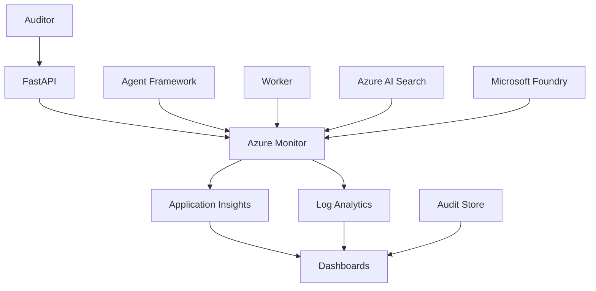

---

# 4. Unified Trace Model

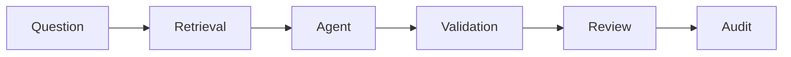

Required fields:

- TraceId
- CorrelationId
- CausationId
- EngagementId
- AgentId
- AgentVersion
- WorkflowVersion
- PromptVersion
- EvidenceVersion
- PolicyVersion

ADR-066

---

# 5. Four Pillars

## Traces

Distributed execution visibility.

## Metrics

Latency, throughput, cost, token usage.

## Logs

Structured operational events.

## Business Events

EvidenceAccepted, RiskCreated, ArtifactApproved.

---

# 6. API Observability

Metrics:

- Request count
- Success rate
- Error rate
- p95 latency
- Auth failures

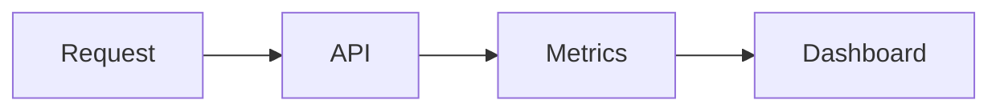

---

# 7. Document Processing Observability

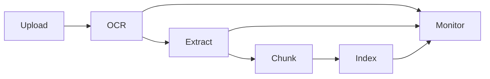

Metrics:

- Processing time
- OCR confidence
- Extraction failure
- Retry count
- Queue depth

---

# 8. Retrieval Observability

Retrieval quality directly impacts answer quality.

Metrics:

- Search latency
- Precision
- Recall
- Citation coverage
- Result count

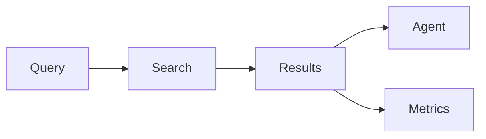

---

# 9. Agent Observability

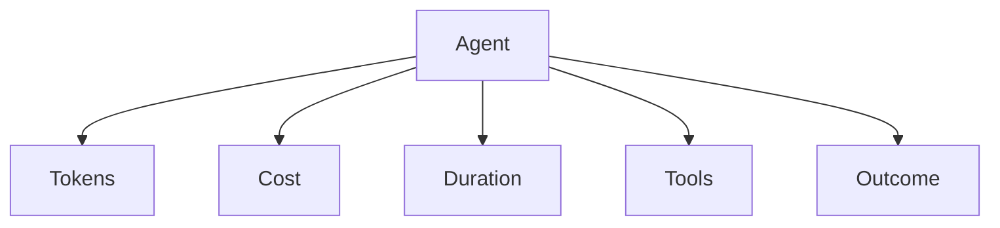

Monitor:

- Agent ID
- Version
- Duration
- Tool calls
- Retries
- Cost
- Outcome

ADR-068

---

# 10. Supervisor Observability

Track:

- Agent selection
- Task decomposition
- Retry decisions
- Conflict resolution

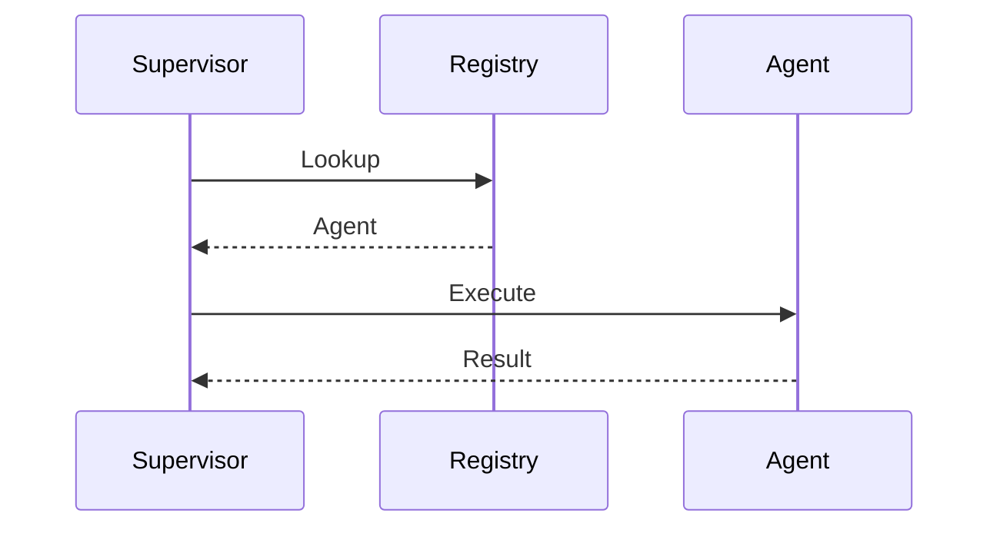

---

# 11. Tool Observability

Metrics:

- Tool usage
- Authorization failures
- Denied calls
- Latency

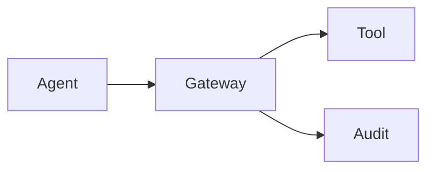

---

# 12. AI Model Observability

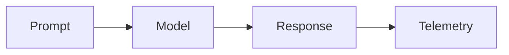

Capture:

- Model name
- Deployment
- Prompt tokens
- Completion tokens
- Cost
- Safety events

ADR-069

---

# 13. Workflow Observability

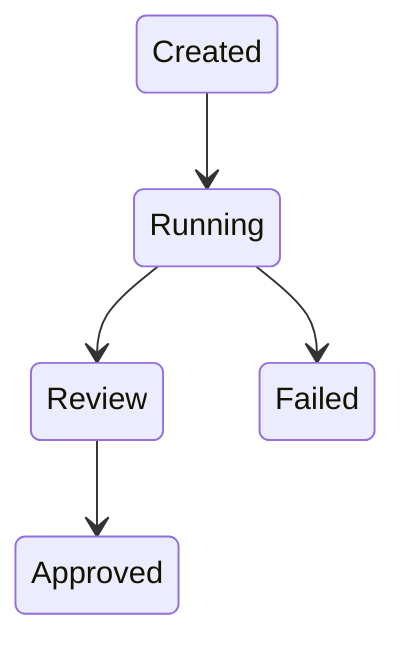

Track:

- Start
- Completion
- Failure
- Retry
- Review waiting

---

# 14. Human Review Observability

Track:

- Reviewer
- Duration
- Approvals
- Rejections
- Overrides

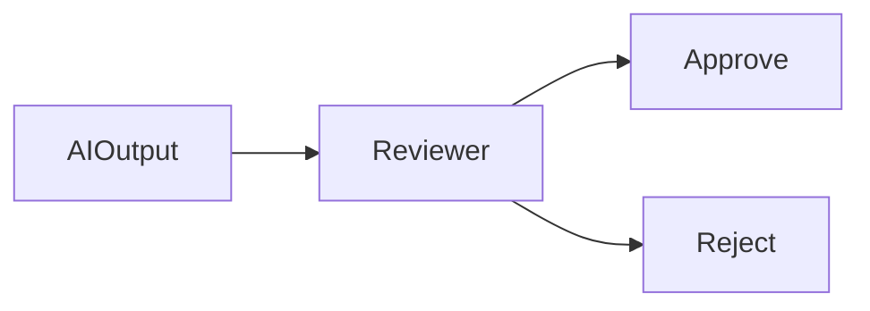

ADR-070

---

# 15. Cost Observability

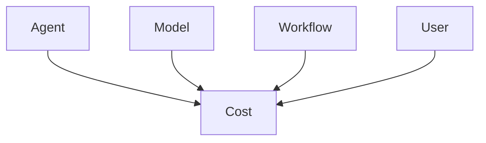

Metrics:

- Cost per response
- Cost per engagement
- Cost per workflow
- Cost per agent

---

# 16. Security Observability

Monitored events:

- Failed login
- Unauthorized access
- Prompt injection attempts
- Privilege escalation
- Tool denial

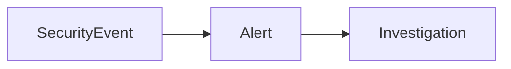

---

# 17. Audit Observability

Separate from operational telemetry.

Track:

- Evidence access
- Approval
- Policy override
- Agent activation
- Prompt change

ADR-067

---

# 18. Dashboard Architecture

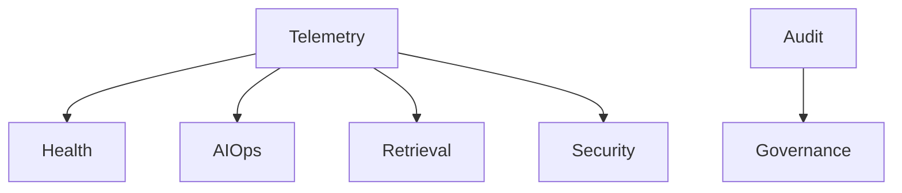

Dashboards:

1. Platform Health
2. AI Operations
3. Retrieval Quality
4. Governance
5. Security

---

# 19. Alerting Model

| Severity | Example |
|---|---|
| Critical | Unauthorized access |
| High | Agent failure |
| Medium | Latency increase |
| Low | Dashboard warning |

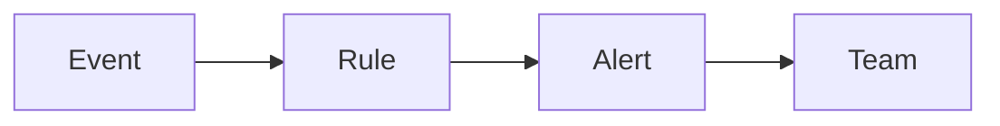

---

# 20. Operational Metrics

| Area | Metrics |
|---|---|
| API | Latency, availability |
| Search | Response time, recall |
| Agent | Cost, duration |
| Workflow | Success rate |
| Review | Approval SLA |
| Security | Threat count |

---

# 21. ADRs

| ADR | Decision |
|---|---|
| ADR-066 | Unified Observability Model |
| ADR-067 | Separate Audit Records from Telemetry |
| ADR-068 | Observe Every Agent Execution |
| ADR-069 | Observe Tokens and Costs |
| ADR-070 | Observe Human Review Workflow |
| ADR-071 | Observe Supervisory Decisions |

---

# 22. Risks

| Risk | Mitigation |
|---|---|
| Broken traces | Correlation propagation |
| Hidden AI cost | Cost dashboards |
| Agent black box | Agent telemetry |
| Missing audit trail | Separate audit store |
| Missed threats | Security alerts |

---

# 23. Acceptance Checklist

- [x] Unified trace model
- [x] API observability
- [x] Processing observability
- [x] Retrieval observability
- [x] Agent observability
- [x] Supervisor observability
- [x] Tool observability
- [x] AI observability
- [x] Workflow observability
- [x] Human review observability
- [x] Cost observability
- [x] Security observability
- [x] Audit observability
- [x] Dashboards
- [x] Alerting
- [x] ADR-066 through ADR-071

---

# Module Status

Accepted.
