# Module 8 – Evaluation

## Status
Accepted

---

# 1. Purpose

Evaluation ensures Audit Workspace produces grounded, measurable, explainable, and governable outputs.

Evaluation covers:

- Retrieval quality
- Agent quality
- Risk detection quality
- Validation effectiveness
- Supervisor decisions
- Workflow outcomes
- Human review effectiveness
- Cost efficiency
- Production quality drift

---

# 2. Evaluation Principles

1. Evaluate the system, not only the model.
2. Groundedness is mandatory.
3. Evidence outweighs confidence.
4. Human review remains authoritative.
5. Evaluation is a production gate.

---

# 3. Evaluation Architecture

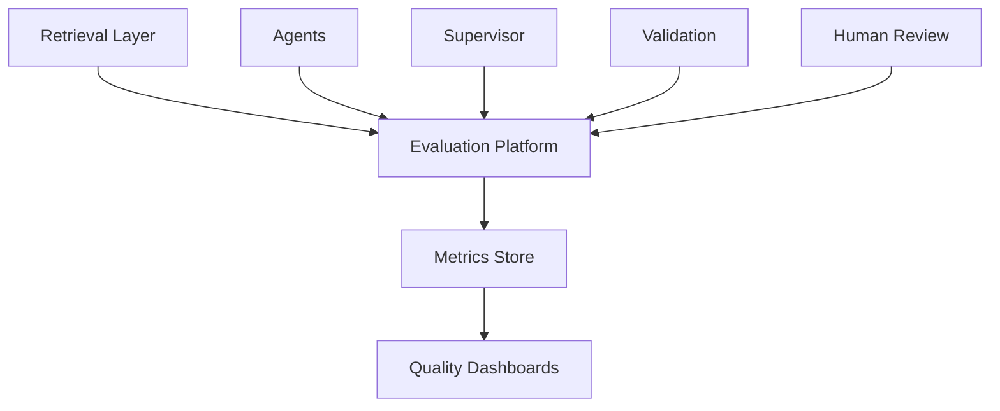

---

# 4. Evaluation Domains

| Domain | Purpose |
|---|---|
| Retrieval | Evidence quality |
| Agent | Agent output quality |
| Supervisor | Agent selection quality |
| Validation | Audit-rule effectiveness |
| Workflow | End-to-end success |
| Review | Human oversight quality |
| Cost | Value versus spend |

---

# 5. Retrieval Evaluation

## Metrics

- Precision@K
- Recall@K
- Citation Coverage
- Retrieval Latency
- Evidence Coverage

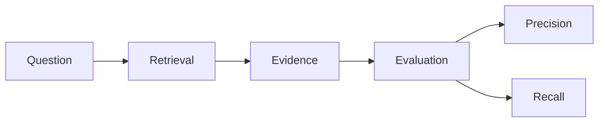

### Recommended Targets

| Metric | Target |
|---|---|
| Precision@10 | >85% |
| Recall@10 | >90% |
| Citation Coverage | >95% |
| p95 Latency | <3 sec |

ADR-072

---

# 6. Agent Evaluation

Each registered agent receives a dedicated evaluation suite.

Evaluation areas:

- Functional correctness
- Groundedness
- Consistency
- Governance compliance
- Safety
- Cost efficiency

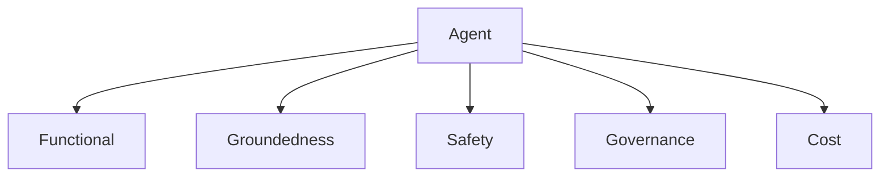

---

# 7. Audit Q&A Evaluation

## Metrics

- Accuracy
- Citation Density
- Hallucination Rate
- Reviewer Acceptance

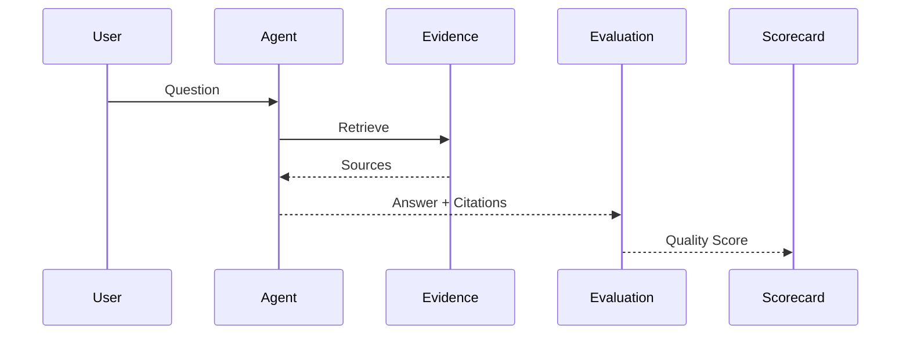

Success Criteria:

- Citations present
- Evidence exists
- Response supported

---

# 8. Evidence Extraction Evaluation

Evaluates extraction of:

- Revenue
- Expenses
- Invoice IDs
- Vendors
- Dates
- Ledger references

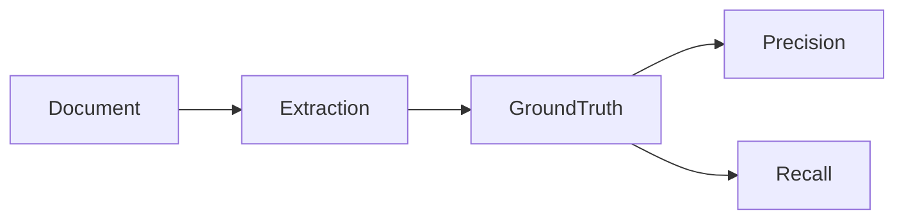

Targets:

| Metric | Target |
|---|---|
| Precision | >95% |
| Recall | >90% |
| Human Correction Rate | <10% |

---

# 9. Risk Detection Evaluation

Metrics:

- Accepted risk rate
- False-positive rate
- Reviewer agreement

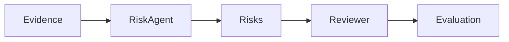

ADR-aligned target:

- Accepted risks >80%
- False positives <15%

---

# 10. Validation Evaluation

Focus:

- Rule coverage
- Rule execution success
- Reviewer overrides

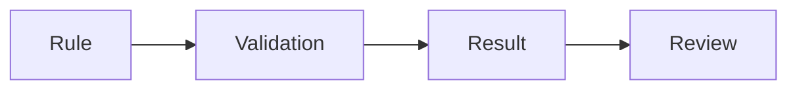

High override rates indicate poor rules, not necessarily poor AI.

---

# 11. Summary Evaluation

Metrics:

- Coverage
- Accuracy
- Citation density
- Reviewer acceptance

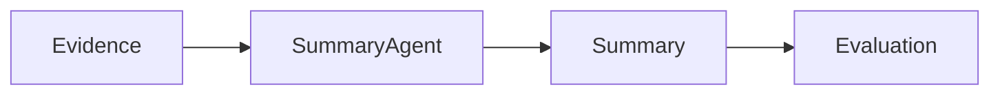

---

# 12. Workflow Assistant Evaluation

Metrics:

- Task success
- Incorrect guidance rate
- User feedback

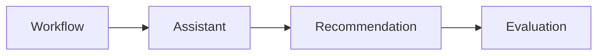

Target:

- Incorrect guidance <2%

---

# 13. Supervisor Evaluation

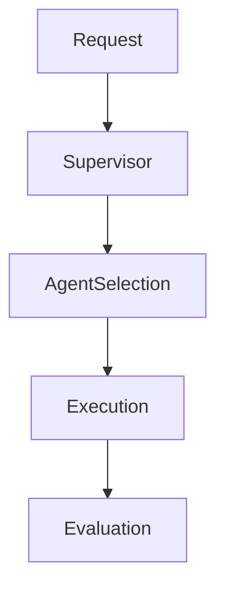

Measures:

- Correct agent selection
- Unnecessary invocations
- Cost efficiency
- Conflict resolution

ADR-076

---

# 14. Workflow Evaluation

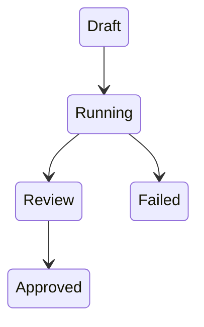

Metrics:

- Completion rate
- Retry rate
- Escalation rate
- Dead letter rate

Targets:

- Completion >95%
- Dead letter <1%

---

# 15. Human Review Evaluation

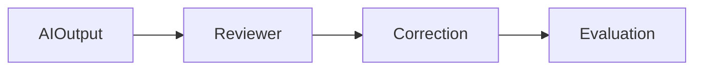

Metrics:

- Review duration
- Correction rate
- Override rate
- Approval rate

ADR-075

---

# 16. Cost Evaluation

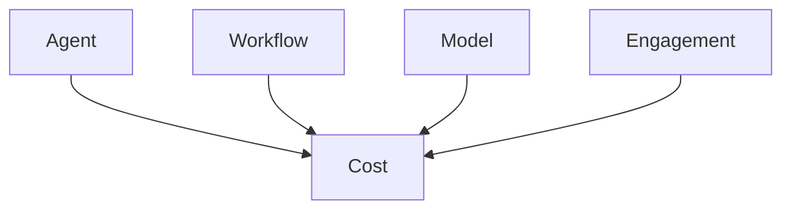

Metrics:

- Cost per response
- Cost per engagement
- Cost per agent
- Cost per risk generated

---

# 17. Evaluation Data Sets

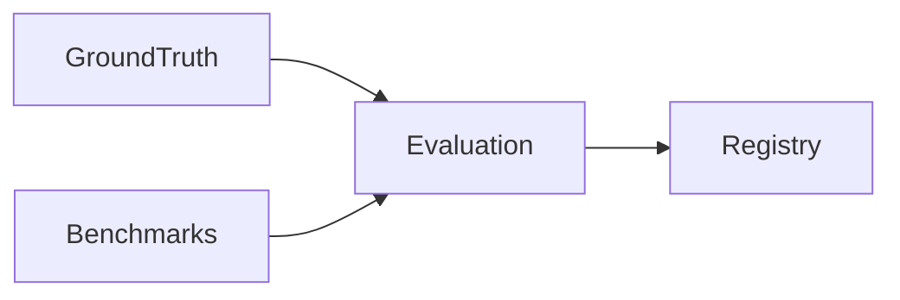

Evaluation owns:

- Ground truth
- Benchmarks
- Expected outputs

ADR-074

---

# 18. Evaluation Lifecycle

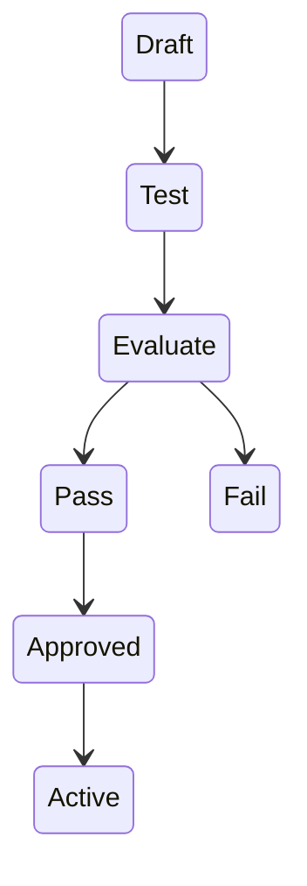

ADR-077

No production activation without PASS.

---

# 19. Evaluation Scorecard

| Area | Weight |
|---|---|
| Groundedness | 30% |
| Accuracy | 25% |
| Retrieval | 15% |
| Safety | 10% |
| Governance | 10% |
| Cost | 10% |

---

# 20. Evaluation Dashboards

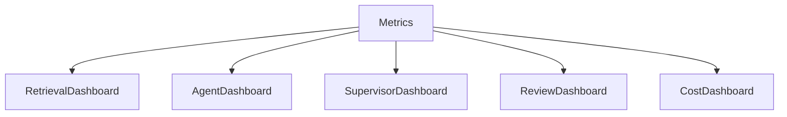

Dashboards:

1. Retrieval Quality
2. Agent Quality
3. Supervisor Quality
4. Review Quality
5. Cost Trends

---

# 21. Continuous Evaluation

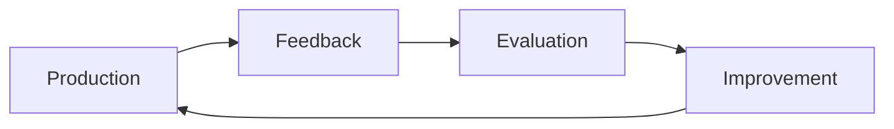

Sources:

- User feedback
- Reviewer corrections
- Reviewer overrides
- Production metrics

---

# 22. ADRs

| ADR | Decision |
|---|---|
| ADR-072 | Evaluate Retrieval Independently |
| ADR-073 | Groundedness Required Gate |
| ADR-074 | Evaluation-Owned Benchmark Data |
| ADR-075 | Human Review Feedback Enters Evaluation |
| ADR-076 | Supervisor Decisions Evaluated |
| ADR-077 | Activation Requires Evaluation Pass |

---

# 23. Risks

| Risk | Mitigation |
|---|---|
| Benchmark drift | Evaluation ownership |
| Hidden retrieval issues | Retrieval metrics |
| Hallucinations | Groundedness gates |
| Agent activation without testing | Activation gate |
| Evaluation staleness | Re-evaluation policy |

---

# 24. Acceptance Checklist

- [x] Retrieval evaluation
- [x] Agent evaluation
- [x] Q&A evaluation
- [x] Extraction evaluation
- [x] Risk evaluation
- [x] Validation evaluation
- [x] Summary evaluation
- [x] Workflow Assistant evaluation
- [x] Supervisor evaluation
- [x] Workflow evaluation
- [x] Human review evaluation
- [x] Cost evaluation
- [x] Evaluation lifecycle
- [x] Scorecard
- [x] Dashboards
- [x] ADR-072 through ADR-077

---

# Module Status

Accepted.
