# Module 9 – Security

## Status
Accepted

---

# 1. Purpose

Security protects sensitive audit evidence, findings, facts, workflows, reviews, and AI interactions.

Security objectives:

- Confidentiality
- Integrity
- Availability
- Traceability
- Non-repudiation
- Regulatory compliance

The architecture adopts:

```text
Zero Trust
+
Least Privilege
+
Defense in Depth
```

---

# 2. Security Architecture

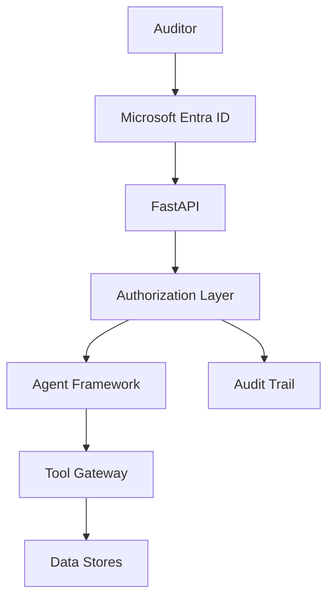

---

# 3. Security Principles

1. Never trust, always verify.
2. Engagement is the primary security boundary.
3. Agents cannot expand privileges.
4. Every action is auditable.
5. Evidence remains authoritative.

---

# 4. Identity Architecture

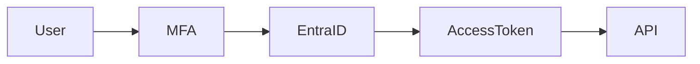

Authentication:

- Single Sign-On
- Multi-Factor Authentication
- Conditional Access
- Federated Identity

---

# 5. Authorization Architecture

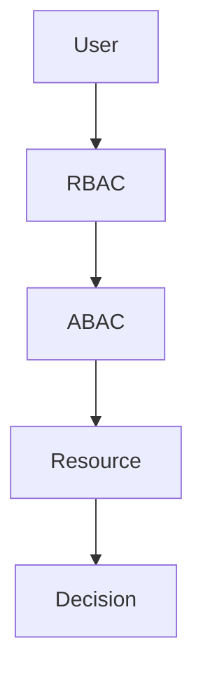

RBAC:

- Auditor
- Audit Manager
- Compliance Reviewer
- System Administrator
- AI Platform Administrator

ABAC:

- Engagement
- Classification
- Workflow State
- Ownership

---

# 6. Engagement Security Boundary

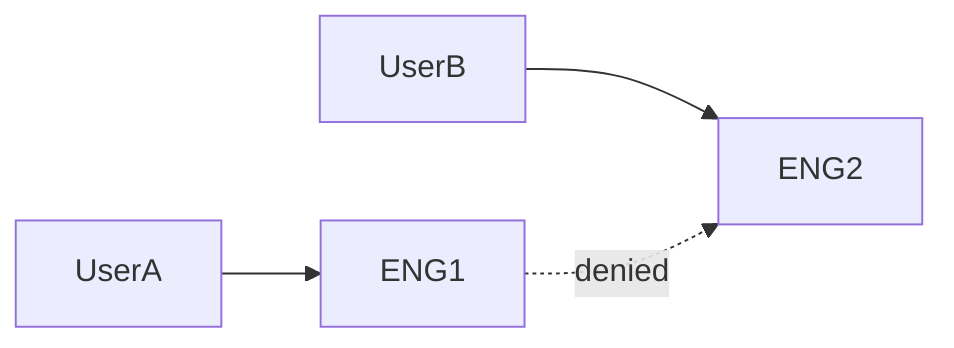

Primary authorization boundary:

```text
Engagement
```

ADR-079

---

# 7. Agent Security

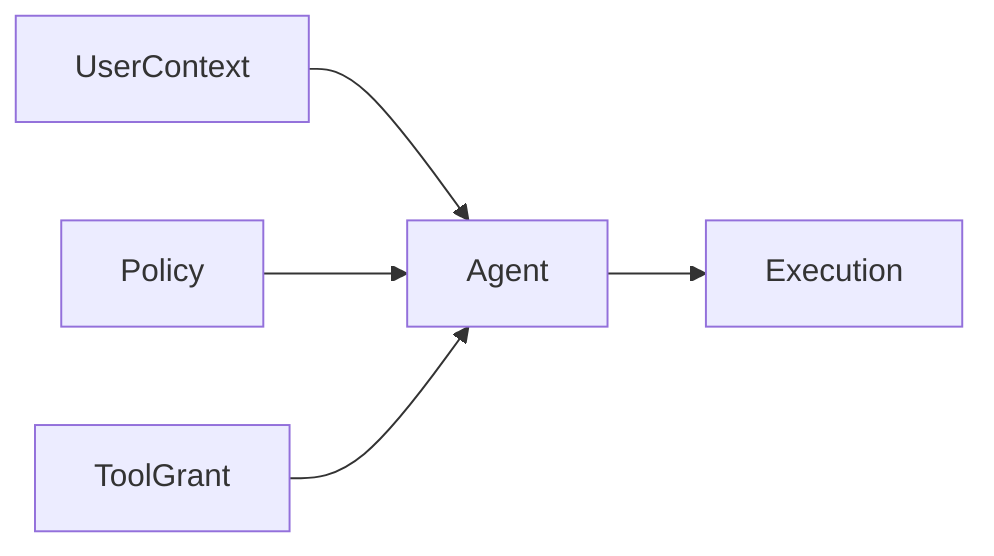

Agents receive:

- User Context
- Policy Context
- Tool Grants

Agents cannot:

- Elevate privileges
- Approve conclusions
- Bypass governance

ADR-080

---

# 8. Tool Security

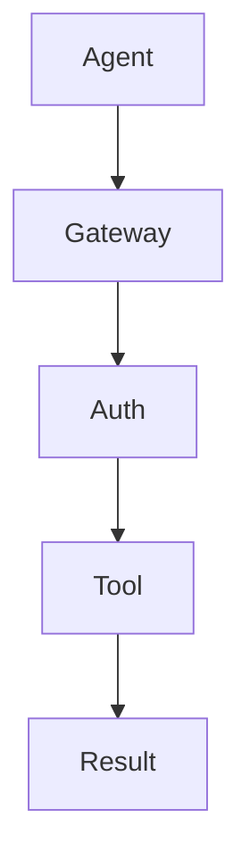

ADR-081

Tools cannot be directly invoked.

---

# 9. Prompt Injection Protection


Controls:

- Retrieved content treated as data
- Policies externalized
- Reauthorization required
- Context isolation

ADR-082

---

# 10. Retrieval Security

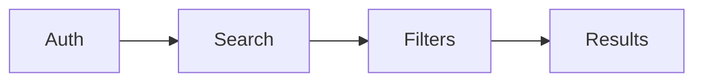

Filters:

- Engagement
- Classification
- Authorization

No bypass permitted.

---

# 11. Data Classification

| Classification | Examples |
|---|---|
| Restricted Audit | Conclusions, approvals |
| Confidential Audit | Evidence, facts |
| Internal | Telemetry |

---

# 12. Encryption Architecture

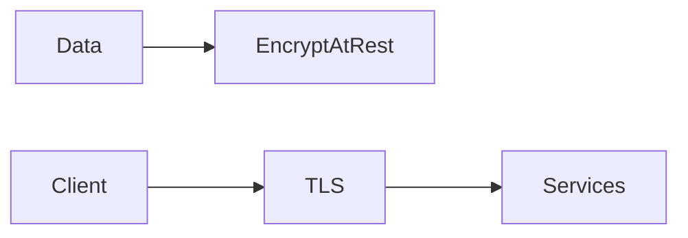

At Rest:

- Blob Storage
- Cosmos DB
- Search
- Service Bus

In Transit:

- TLS
- HTTPS

---

# 13. Secrets Management


Rules:

- No secrets in prompts
- No secrets in registry
- No secrets in source code

ADR-083

---

# 14. Network Security

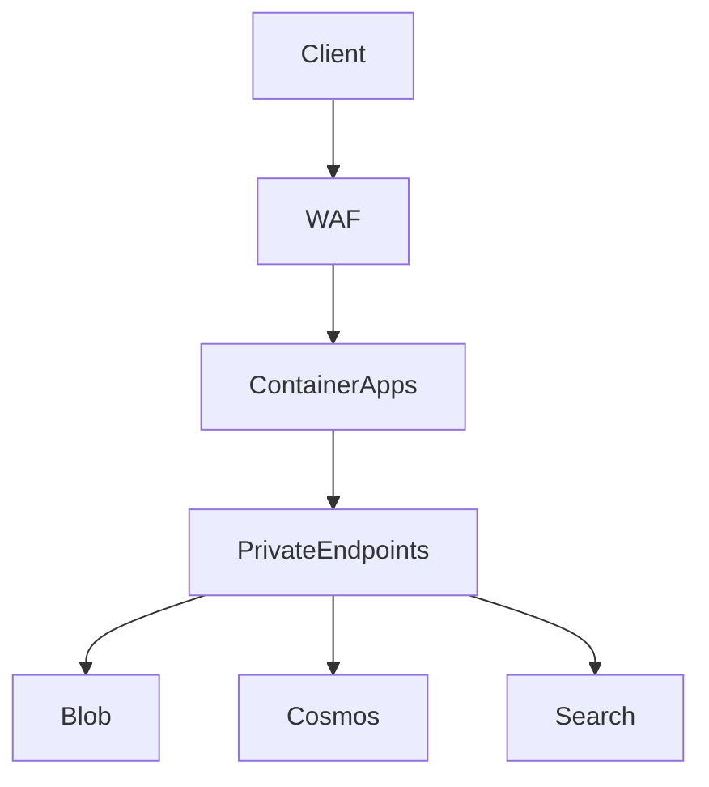

Controls:

- Private endpoints
- Network isolation
- Restricted egress
- WAF

ADR-084

---

# 15. Managed Identity Security

Runtime identities:

- API
- Worker
- Indexer
- Dispatcher

Shared secrets prohibited.

---

# 16. Registry Security

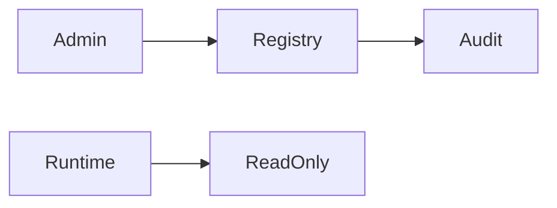

Activation requires:

- Approval
- Evaluation pass

---

# 17. Workflow Security

Workflow resumption validates:

- Agent Version
- Workflow Version
- Authorization
- Engagement

Expired authorization stops execution.

---

# 18. Review Security

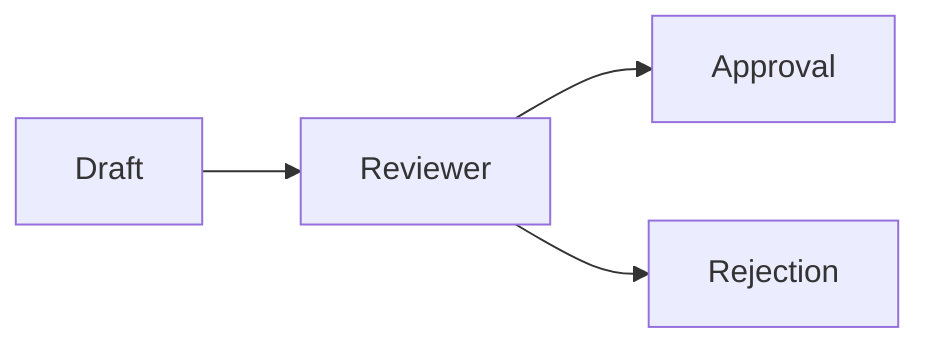

Controls:

- Separation of Duties
- No self approval
- Immutable decisions

---

# 19. Audit Security

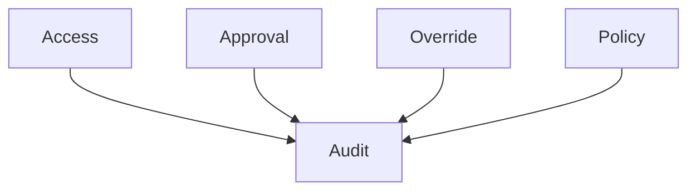

Audit retention:

```text
7 Years
```

ADR-085

---

# 20. Security Monitoring

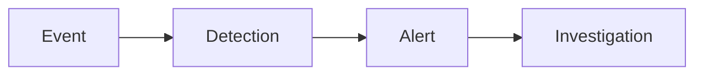

Monitor:

- Failed logins
- Prompt injections
- Privilege escalation
- Data-access violations

---

# 21. External MCP Security

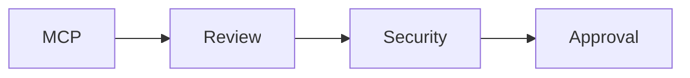

Requirements:

- Security review
- Architecture review
- Compliance approval

---

# 22. Incident Response

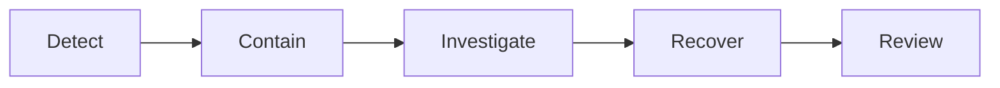

Severity:

- Critical
- High
- Medium
- Low

---

# 23. ADRs

| ADR | Decision |
|---|---|
| ADR-078 | Zero Trust Security Model |
| ADR-079 | Engagement Security Boundary |
| ADR-080 | Agents Cannot Expand Privileges |
| ADR-081 | Tool Calls Require Reauthorization |
| ADR-082 | Prompt Context Is Not Security Boundary |
| ADR-083 | Managed Identity by Default |
| ADR-084 | Private Connectivity for Production |
| ADR-085 | Separate Audit Records from Telemetry |

---

# 24. Risks

| Risk | Mitigation |
|---|---|
| Prompt Injection | Context isolation |
| Data Leakage | Authorization |
| Privilege Escalation | Reauthorization |
| Secret Exposure | Key Vault |
| Registry Tampering | Governance approval |

---

# 25. Acceptance Checklist

- [x] Identity architecture
- [x] Authorization architecture
- [x] Engagement security boundary
- [x] Agent security
- [x] Tool security
- [x] Retrieval security
- [x] Encryption architecture
- [x] Secrets management
- [x] Network security
- [x] Workflow security
- [x] Review security
- [x] Audit security
- [x] Monitoring
- [x] Incident response
- [x] ADR-078 through ADR-085

---

# Module Status

Accepted.
