# Module 10 – Governance

## Status
Accepted

---

# 1. Purpose

Governance ensures Audit Workspace remains:

- Auditable
- Explainable
- Controlled
- Traceable
- Compliant
- Human-supervised

The solution design requires versioned prompts, versioned agents, model monitoring, human review before audit conclusions, controlled access, evaluation, traceability, and audit logging. Source requirements are derived from the Audit Workspace Solution Design Document. 

---

# 2. Governance Principles

1. Human accountability remains mandatory.
2. No audit conclusion is autonomous.
3. Governance overrides convenience.
4. Every material output is traceable.
5. Production change requires approval.

---

# 3. Governance Architecture

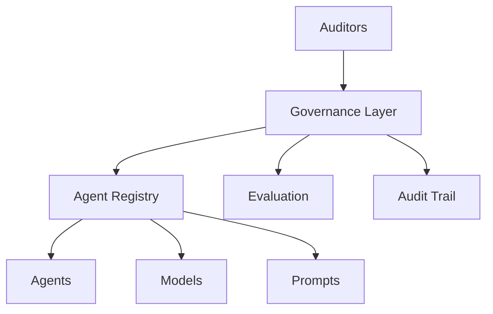

---

# 4. Governance Domains

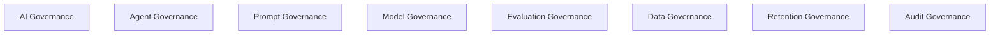

Domains:

- AI Governance
- Agent Governance
- Prompt Governance
- Model Governance
- Evaluation Governance
- Human Oversight Governance
- Data Governance
- Retention Governance
- Audit Governance

---

# 5. Governance Roles

| Role | Responsibility |
|---|---|
| Auditor | Review outputs |
| Audit Manager | Approve findings |
| Compliance Reviewer | Compliance checks |
| System Administrator | Platform administration |
| AI Platform Administrator | Agents, prompts, models |

---

# 6. Agent Governance

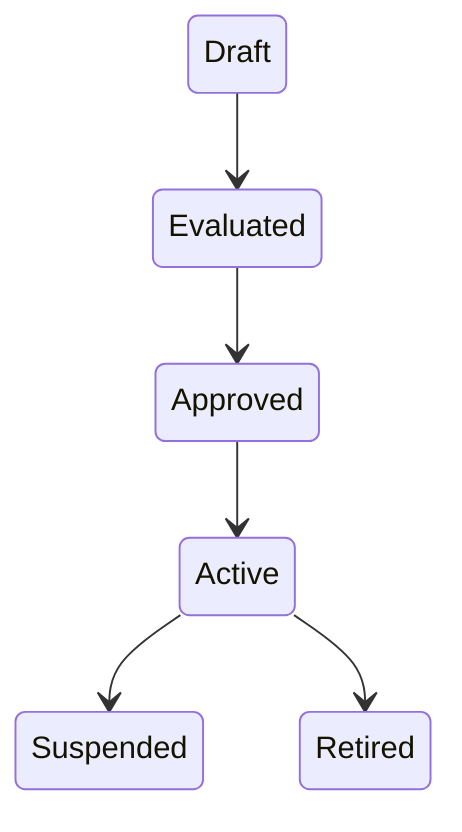

Requirements:

- Owner
- Version
- Evaluation
- Approval
- Rollback

ADR-086

---

# 7. Prompt Governance

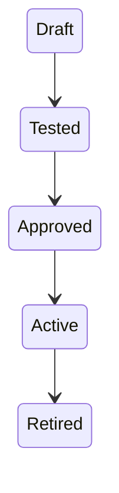

Governed attributes:

- Prompt ID
- Version
- Owner
- Purpose
- Status

ADR-088

---

# 8. Model Governance

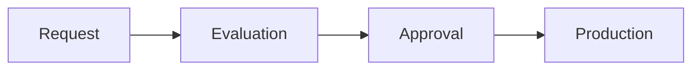

Track:

- Model Family
- Version
- Provider
- Region
- Cost

ADR-089

---

# 9. Evaluation Governance

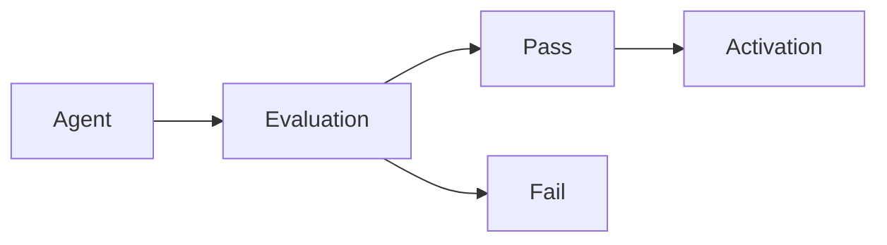

Required:

- Accuracy
- Groundedness
- Safety
- Cost
- Compliance

Evaluations expire after policy-defined period.

---

# 10. Tool Governance

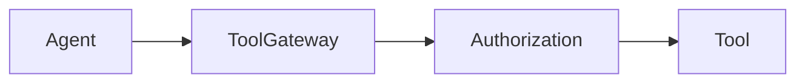

Every tool requires:

- Tool ID
- Owner
- Version
- Access Rules

---

# 11. MCP Governance

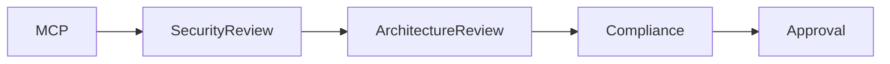

External MCP access is restricted.

---

# 12. Human Oversight Governance

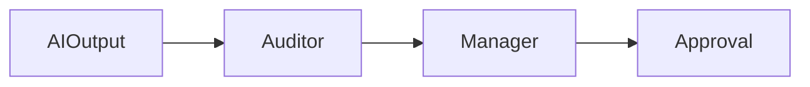

Mandatory human decisions:

- Findings
- Conclusions
- Governance exceptions
- Publication

ADR-090

---

# 13. Data Governance

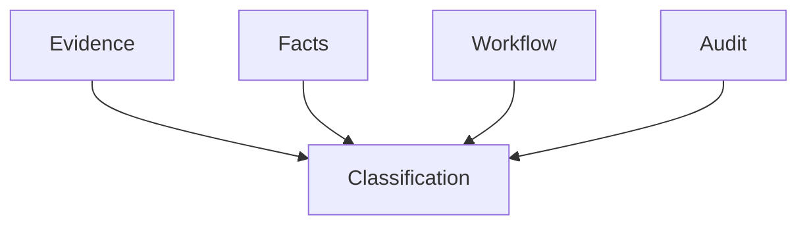

Controls:

- Ownership
- Classification
- Lineage
- Retention

---

# 14. Retention Governance

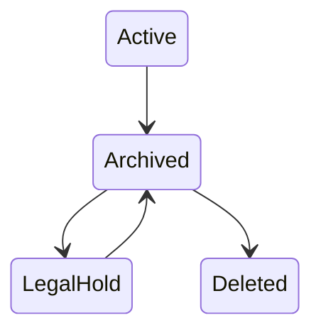

Baseline:

- Audit evidence: 7 years
- Findings: 7 years
- Audit trail: 7 years
- Conversation history: 180 days

---

# 15. Change Governance

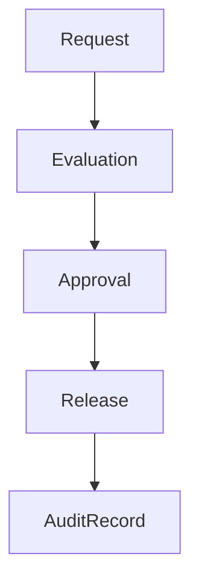

Applies to:

- Agents
- Models
- Prompts
- Policies
- Rules

---

# 16. Audit Governance

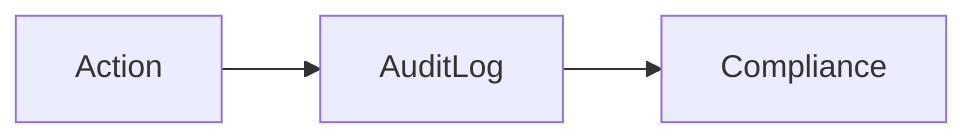

Examples:

- Evidence access
- Approval
- Agent activation
- Prompt modification

---

# 17. Governance Exceptions

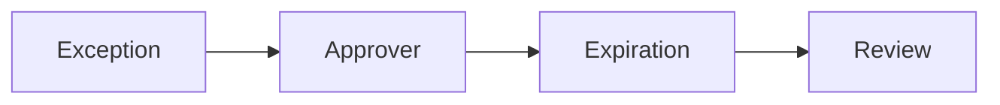

Required:

- Reason
- Approver
- Duration
- Compensating control

ADR-091

---

# 18. Responsible AI Governance

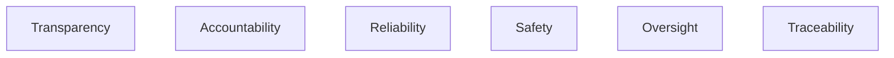

Requirements:

- Source citations
- Human accountability
- Safe operation
- Explainability

ADR-092

---

# 19. Governance Metrics

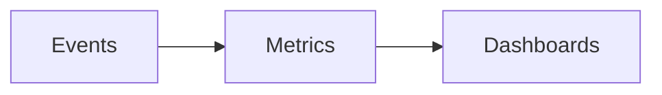

Measure:

- Prompt changes
- Agent activations
- Evaluation failures
- Policy overrides
- Exception counts

---

# 20. Governance Dashboards

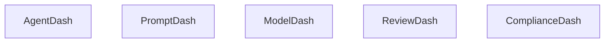

Dashboards:

1. Agent Governance
2. Prompt Governance
3. Model Governance
4. Review Governance
5. Compliance Governance

---

# 21. Governance Operating Model

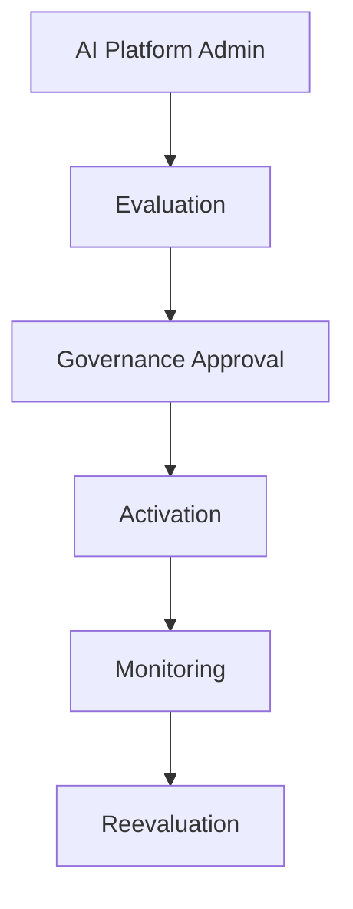

Audit conclusion flow:

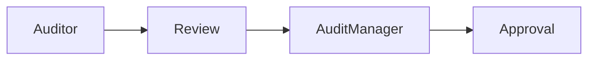

---

# 22. ADRs

| ADR | Decision |
|---|---|
| ADR-086 | Governance Controls Production AI Assets |
| ADR-087 | No Activation Without Governance Approval |
| ADR-088 | Prompts Are Governed Assets |
| ADR-089 | Model Approval Required |
| ADR-090 | Human Oversight Mandatory |
| ADR-091 | Governance Exceptions Approved |
| ADR-092 | Responsible AI Enforced Through Governance |

---

# 23. Risks

| Risk | Mitigation |
|---|---|
| Unapproved activation | Registry governance |
| Prompt drift | Version control |
| Model drift | Reevaluation |
| Missing review | Approval workflow |
| Governance bypass | Audit trail |

---

# 24. Assumptions

- AI Platform Administrator exists.
- Compliance Reviewer exists.
- Legal hold capability exists.
- Evaluation platform exists.

---

# 25. Acceptance Checklist

- [x] Governance domains accepted
- [x] Agent governance accepted
- [x] Prompt governance accepted
- [x] Model governance accepted
- [x] Evaluation governance accepted
- [x] Tool governance accepted
- [x] Human oversight accepted
- [x] Data governance accepted
- [x] Retention governance accepted
- [x] Audit governance accepted
- [x] Responsible AI governance accepted
- [x] ADR-086 through ADR-092 accepted

---

# Module Status

Accepted.
