# Audit Workspace – Executive Architecture Summary

## Document Purpose

This document summarizes the complete Audit Workspace Architecture across Modules 1–10.

The solution is an Azure-hosted, AI-powered audit platform that centralizes audit evidence, enables Retrieval-Augmented Generation (RAG), provides governed AI agents, and preserves human accountability for audit decisions.

---

# Architecture Vision

```text
Unified Audit Workspace
+
Intelligent Retrieval
+
Governed Multi-Agent System
+
Human Oversight
+
Enterprise Security
+
End-to-End Traceability
```

---

# Business Goals

- Centralize audit artifacts
- Improve evidence discovery
- Accelerate audit reviews
- Enable natural language audit Q&A
- Improve risk identification
- Maintain audit defensibility
- Preserve human accountability

---

# High-Level Architecture

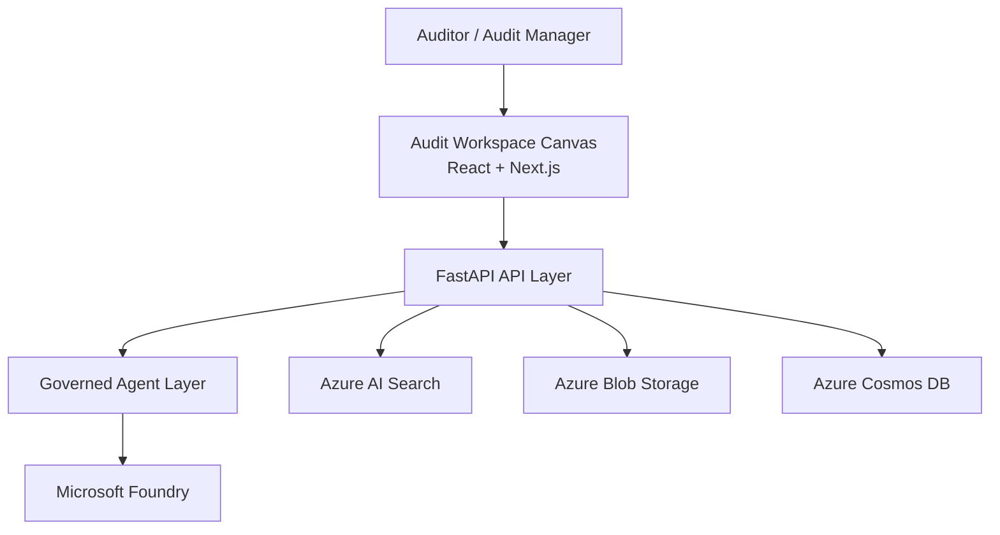

---

# Core Building Blocks

## Frontend

- React
- Next.js
- Audit Canvas UX

## Backend

- Python FastAPI
- Microsoft Agent Framework

## AI Platform

- Microsoft Foundry

## Retrieval

- Azure AI Search

## Document Processing

- Azure AI Document Intelligence

## Storage

- Azure Blob Storage
- Azure Cosmos DB

## Messaging

- Azure Service Bus Premium

---

# Agent Architecture

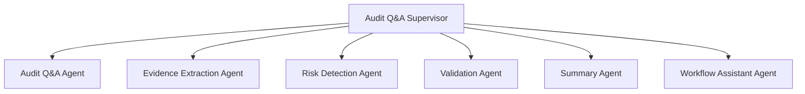

### Registered Agents

- Audit Q&A Agent
- Evidence Extraction Agent
- Risk Detection Agent
- Validation Agent
- Summary Agent
- Workflow Assistant Agent
- Audit Q&A Supervisor

---

# Agent Registry

The platform uses a governed agent registry.

Key capabilities:

- Capability catalog
- Immutable versions
- Evaluation gates
- Activation controls
- Rollback
- Frozen engagement versions

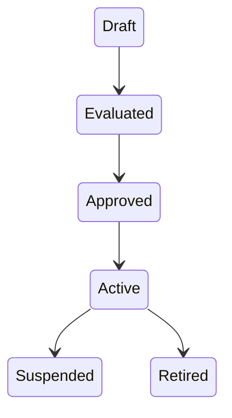

---

# Memory Architecture

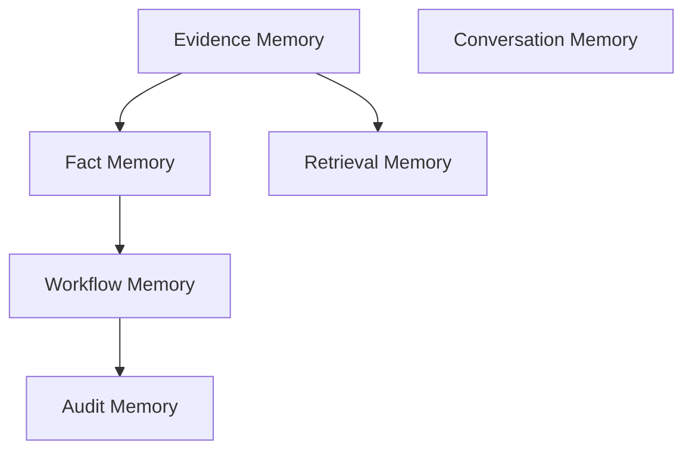

Memory domains:

- Evidence Memory
- Fact Memory
- Retrieval Memory
- Workflow Memory
- Conversation Memory
- Audit Memory

---

# Communication Architecture

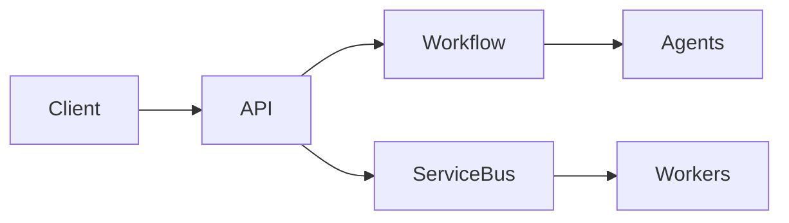

Patterns:

- Commands
- Queries
- Domain Events
- Agent Workflows
- Server-Sent Events
- Azure Service Bus

---

# Observability

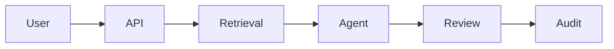

Observes:

- API execution
- Retrieval quality
- Agent execution
- Cost
- Human review
- Governance events
- Security events

---

# Evaluation Architecture

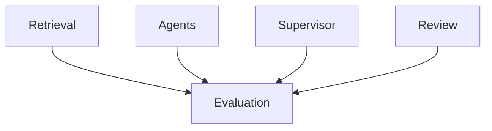

Evaluation domains:

- Retrieval
- Agents
- Supervisor
- Validation
- Workflow
- Human Review
- Cost

Production activation requires evaluation pass.

---

# Security Architecture

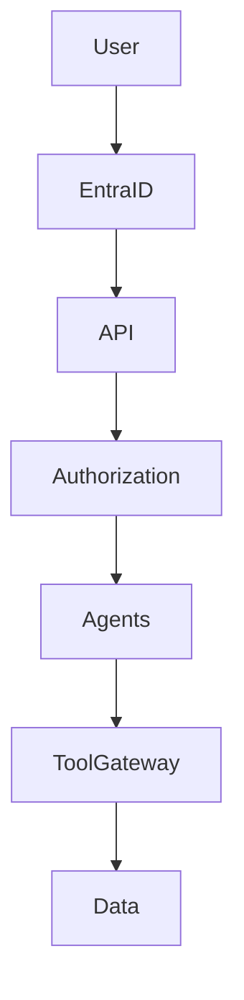

Security principles:

- Zero Trust
- Least Privilege
- Defense in Depth
- Engagement Boundary
- Managed Identities
- Audit Logging

---

# Governance Architecture

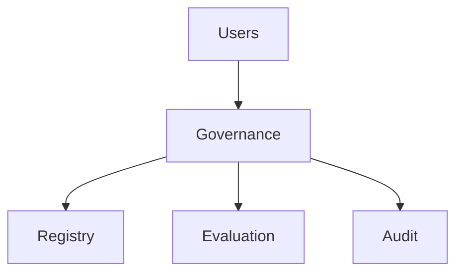

Governance domains:

- Agent Governance
- Prompt Governance
- Model Governance
- Evaluation Governance
- Data Governance
- Retention Governance
- Audit Governance

---

# Human Oversight

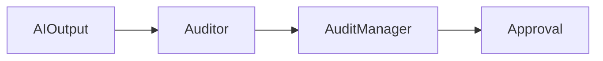

AI may:

- Suggest
- Extract
- Summarize
- Recommend

AI may not:

- Approve
- Sign Off
- Conclude Audits

---

# Data Flow

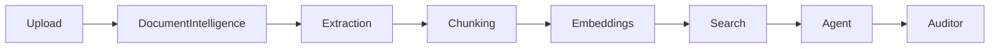

---

# Security Controls

- Microsoft Entra ID
- MFA
- RBAC
- ABAC
- Managed Identity
- Key Vault
- Private Endpoints
- TLS Encryption
- Audit Logging

---

# Governance Controls

- Versioned Agents
- Versioned Prompts
- Model Governance
- Human Approval
- Audit Trail
- Evaluation Gates
- Responsible AI Controls

---

# Key Architecture Decisions

| Area | Decision |
|---|---|
| Architecture Style | Modular Monolith |
| AI Pattern | RAG + Governed Agents |
| Memory | Domain-Governed Memory |
| Search | Index Per Engagement |
| Messaging | Hybrid + Service Bus |
| Agent Runtime | Local Runtime |
| Governance | Evaluation-Gated |
| Security | Zero Trust |
| Oversight | Human-in-the-Loop |

---

# Technology Stack

| Layer | Technology |
|---|---|
| UI | React / Next.js |
| APIs | FastAPI |
| Agent Runtime | Microsoft Agent Framework |
| AI Platform | Microsoft Foundry |
| Search | Azure AI Search |
| OCR / Extraction | Azure AI Document Intelligence |
| Storage | Blob Storage |
| Operational Data | Cosmos DB |
| Messaging | Azure Service Bus Premium |
| Identity | Microsoft Entra ID |
| Secrets | Azure Key Vault |
| Monitoring | Azure Monitor / App Insights |

---

# Architecture Outcome

Audit Workspace delivers:

- Unified audit experience
- Evidence-centered AI assistance
- Governed multi-agent orchestration
- Enterprise-grade security
- Full traceability
- Human-controlled audit conclusions
- Production-grade observability
- Responsible AI governance

---

# Architecture Modules

1. [Introduction](/docs/01-Introduction.md)
2. [Building Blocks](/docs/02-Building-Blocks.md)
3. [Design Options](/docs/03-Design-Options.md)
4. [Agent Registry](/docs/04-Agent%20Registry.md)
5. [Memory](/docs/05-Memory.md)
6. [Agent Communication](/docs/06-Agent-Communication.md)
7. [Observability](/docs/07-Observability.md)
8. [Evaluation](/docs/08-Evaluation.md)
9. [Security](/docs/09-Security-Full.md)
10. [Governance](/docs/10-Governance.md)

This document serves as the executive summary of the complete Audit Workspace Architecture Repository.
